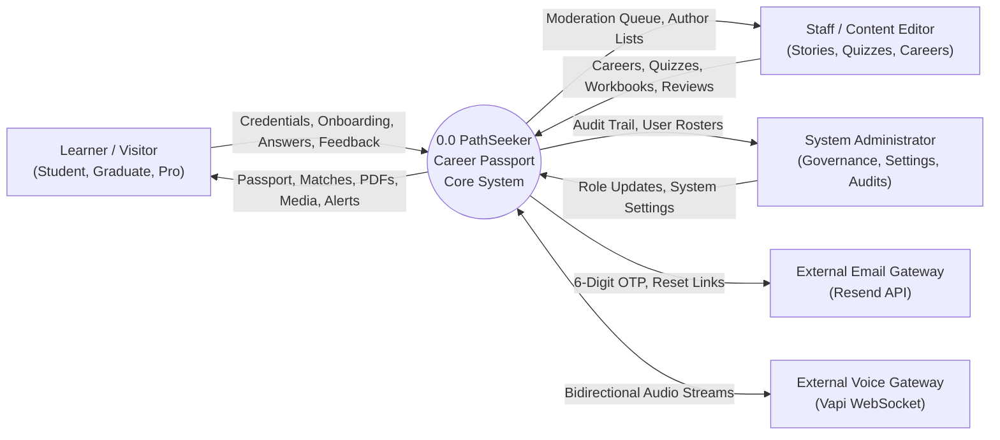
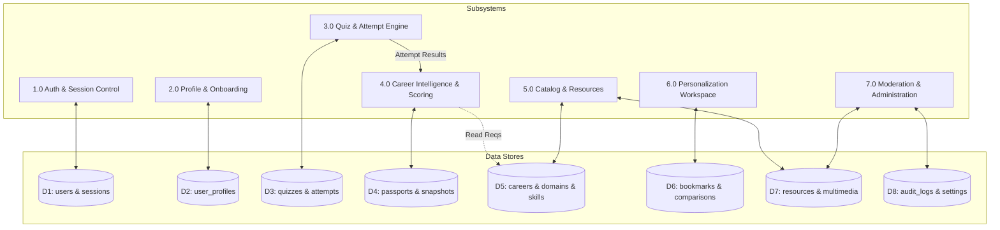
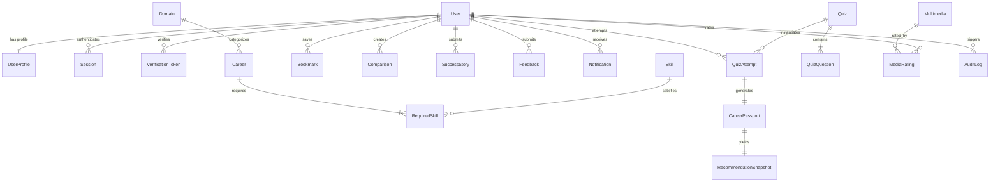

# PathSeeker — Career Passport Project Documentation

> **Document Identifier:** PS-DOC-001  
> **Version:** 1.0 (Implementation Baseline)  
> **Project Name:** PathSeeker Career Passport  
> **Project Team:** StackVerse  
> **Prepared for:** Aptech TechWiz Competition  
> **Baseline Date:** 27 August 2026  
> **Primary Authority:** `PathSeeker_Career_Passport_SRS_Clean.md`  
> 
> ### Development Team & Student Identifiers:
> * **MIRZA ABDULLAH BAIG** (Student ID: `1600671`) — Lead Frontend / Backend / Voice  
> * **HAMZA SHOAIB** (Student ID: `1598434`) — Team Backend  
> * **GHULAM MOIN UDDIN** (Student ID: `1612301`) — Team Voice  
> * **MUHAMMAD FARUKH** (Student ID: `1612368`) — Voice  

---

## Table of Contents

1. [Executive Summary & Product Vision](#1-executive-summary--product-vision)
2. [Problem Definition & Target Personas](#2-problem-definition--target-personas)
3. [System Architecture & Technology Stack](#3-system-architecture--technology-stack)
4. [User Journeys & Screen-by-Screen Walkthrough (with Screenshots)](#4-user-journeys--screen-by-screen-walkthrough)
   - 4.1 Welcome & Public Landing
   - 4.2 Registration, Security & Verification
   - 4.3 Guided Onboarding Wizard
   - 4.4 Personalized Learner Dashboard & Career Passport
   - 4.5 Psychometric Assessment & Quiz
   - 4.6 Explainable Career Recommendations
   - 4.7 Career Bank & Multi-Facet Filtering
   - 4.8 Sourced Career Detail & Interactive Skill Simulator
   - 4.9 PDF Resource Library & In-Browser Viewer
   - 4.10 Bookmarks, Saved Roadmaps & Private Notes
   - 4.11 Community Success Stories Hub & Moderation
   - 4.12 User Profile, Accessibility & Preferences
   - 4.13 Learner Feedback & Support
   - 4.14 Navi Conversational Assistant & Voice Guidance Mode
   - 4.15 Admin Control Center (Analytics, Users, Careers, Quiz Builder, Stories, Feedback)
   - 4.16 Mobile Viewports & Touch Experience
5. [Data Architecture & Database Design](#5-data-architecture--database-design)
6. [Deterministic Career Intelligence & Scoring Engine](#6-deterministic-career-intelligence--scoring-engine)
7. [API Catalogue & Endpoint Reference](#7-api-catalogue--endpoint-reference)
8. [Security, Access Control & Quality Governance](#8-security-access-control--quality-governance)
9. [Automated Verification & Quality Evidence](#9-automated-verification--quality-evidence)
10. [SRS Requirements Traceability Matrix](#10-srs-requirements-traceability-matrix)
11. [Installation, Operations & Sign-Off](#11-installation-operations--sign-off)

---

## 1. Executive Summary & Product Vision

**PathSeeker** is a responsive, full-stack Career Passport web application created to transform career uncertainty into clear, evidence-based, actionable roadmaps. Designed for secondary students, university graduates, and mid-career switchers, PathSeeker bridges the gap between self-discovery and occupational realities.

### Key Value Proposition
- **Durable Career Passport:** Persists a learner's psychometric archetype, normalized trait signals, verified skills, and career aspirations.
- **Explainable Recommendation Engine:** Replaces opaque black-box recommendations with deterministic, auditable compatibility and readiness scores based on U.S. Bureau of Labor Statistics (BLS 2024–2034) occupational data.
- **Integrated Learning Library:** Provides direct access to 6 original PDF workbooks (51 pages total) and 6 verified Google Career Certificates expert videos.
- **Interactive Growth Simulator:** Allows learners to test what-if skill development scenarios without corrupting underlying profile records.
- **Navi Guidance Agent:** Features a character-driven assistant supporting text and voice guidance to make career exploration intuitive and supportive.

---

## 2. Problem Definition & Target Personas

### 2.1 The Core Problems
1. **Fragmented Guidance:** Job market statistics, required skill taxonomies, and learning resources are scattered across disconnected portals.
2. **Black-Box Suggestions:** Existing career recommendation engines output arbitrary job titles without explaining *why* a role suits the user.
3. **Skill-Gap Uncertainty:** Learners lack clarity on the specific delta between their current competencies and industry prerequisites.
4. **Static & Impersonal Data:** Traditional career advice does not adapt as learners acquire new skills and certifications.

### 2.2 Target Personas

| Persona | Stage | Credentials | Core Need & PathSeeker Solution |
|---|---|---|---|
| **Alex Morgan (Student)** | Undergraduate (Psychology) | `demo.student@pathseeker.local`<br>`PathSeeker-Demo-2026!` | Discover people-centered technology careers aligning with empathy and research via career quiz & roadmaps. |
| **Zara Noor (Graduate)** | CS Graduate | `demo.graduate@pathseeker.local`<br>`PathSeeker-Demo-2026!` | Target software engineering roles, bridge React/JS skill gaps, and explore interactive career roadmaps. |
| **Daniel Kim (Professional)** | Finance Professional | `demo.professional@pathseeker.local`<br>`PathSeeker-Demo-2026!` | Transition into Data Analysis, compare remote careers, and simulate SQL/data analytics skill growth. |
| **Sarah Malik (Super Admin)** | Super Administrator | `admin@pathseeker.local`<br>`PathSeeker-Demo-2026!` | System governance, user role administration, catalog management, and audit log inspection. |

---

## 3. System Architecture & Technology Stack

PathSeeker follows a robust, layered **MERN (MongoDB, Express, React, Node.js)** architecture:

```
[ Browser Client ]  (React 18 + Vite SPA, TanStack Query v5, Zustand, Vanilla CSS)
       │ HTTP REST API + HttpOnly Cookie Sessions
[ API Gateway ]     (Express.js, Helmet, CORS Allowlist, Rate Limiting, Sanitization)
       │ Controllers ── Input Validation ── Session Authentication Middleware
[ Application Layer](AuthService, PassportService, RecommendationEngine, CatalogService)
       │ Mongoose ODM
[ Database Layer ]  (MongoDB 7+, 27 Models, Compound Text/Unique Indexes)
```

- **Frontend:** React 18, Vite, TanStack Query v5, React Hook Form + Zod, Lucide Icons, Sonner.
- **Backend:** Node.js 20+, Express.js, Bcrypt (salt rounds: 12), Crypto, Mongoose 8+.
- **Persistence:** MongoDB with indexed schemas, TTL session expiration, and immutable snapshot collections.
- **External Integrations:** Vapi WebSocket voice provider (optional/conditional), Resend transactional email (console fallback).

---

## 4. User Journeys & Screen-by-Screen Walkthrough

### 4.1 Welcome & Public Landing
- **File:** `../Project/frontend/screenshots/desktop/01-welcome.png`
- **Route:** `/?screen=welcome`
- **Functionality:** Provides immediate value orientation, entry to the career assessment, public exploration of the Career Bank, and access to the interactive Navi assistant.

### 4.2 Registration, Security & Verification
- **File:** `../Project/frontend/screenshots/desktop/02-signup.png`
- **Route:** `/?screen=signup`
- **Functionality:** Secure account creation requiring strong passwords (uppercase, lowercase, number, special character). Implements single-use 6-digit cryptographic OTP email verification.

### 4.3 Guided Onboarding Wizard
- **File:** `../Project/frontend/screenshots/desktop/03-onboarding.png`
- **Route:** `/?screen=onboarding`
- **Functionality:** Step-by-step wizard capturing academic background, core interests, preferred work environments, and baseline skill proficiencies.

### 4.4 Personalized Learner Dashboard & Career Passport
- **File:** `../Project/frontend/screenshots/desktop/04-dashboard.png`
- **Route:** `/?screen=dashboard`
- **Functionality:** Central command center displaying the learner's Career Passport archetype (*Insight Explorer*, *Creative Builder*), evidence completion progress (0–100%), top matched careers, weekly goals, and recent activity.

### 4.5 Psychometric Assessment & Quiz
- **File:** `../Project/frontend/screenshots/desktop/05-quiz.png`
- **Route:** `/?screen=quiz`
- **Functionality:** Structured interest questionnaire mapping user responses to 7 psychometric traits (Creative, Analytical, Technical, People-focused, Communication, Empathy, Organization) and 10 occupational domains.

### 4.6 Explainable Career Recommendations
- **File:** `../Project/frontend/screenshots/desktop/06-recommendations.png`
- **Route:** `/?screen=recommendations`
- **Functionality:** Ranked career opportunities detailing separate **Compatibility %** (personality and interest alignment) and **Readiness %** (current technical skill preparation).

### 4.7 Career Bank & Multi-Facet Filtering
- **File:** `../Project/frontend/screenshots/desktop/07-career-bank.png`
- **Route:** `/?screen=careers`
- **Functionality:** Catalog of 15 sourced careers filterable by occupational domain, salary threshold ($50k–$150k+), growth outlook (High, Very High), and required skills.

### 4.8 Sourced Career Detail & Interactive Skill Simulator
- **File:** `../Project/frontend/screenshots/desktop/08-career-detail.png`
- **Route:** `/?screen=career-detail&career=ux-designer`
- **Functionality:** Deep-dive into daily job responsibilities, entry education requirements, wage percentiles, and an interactive slider simulator for testing skill improvements.

### 4.9 PDF Resource Library & In-Browser Viewer
- **File:** `../Project/frontend/screenshots/desktop/09-resources.png`
- **Route:** `/?screen=resources`
- **Functionality:** Access to 6 original PDF workbooks (51 total pages) with an embedded PDF viewer and verified download counters.

### 4.10 Bookmarks, Saved Roadmaps & Private Notes
- **File:** `../Project/frontend/screenshots/desktop/10-saved-notes.png`
- **Route:** `/?screen=saved`
- **Functionality:** Polymorphic bookmarking repository for careers, videos, and articles, complete with rich text private learner notes and PDF export capabilities.

### 4.11 Community Success Stories Hub & Moderation
- **File:** `../Project/frontend/screenshots/desktop/11-success-stories.png`
- **Route:** `/?screen=stories`
- **Functionality:** Real career transition narratives submitted by learners, reviewed by staff through an editorial workflow, and published with milestone timelines.

### 4.12 User Profile, Accessibility & Preferences
- **File:** `../Project/frontend/screenshots/desktop/12-profile-settings.png`
- **Route:** `/?screen=profile`
- **Functionality:** Comprehensive settings interface for managing personal information, skill self-ratings, theme preferences, dynamic font scaling (85%–130%), and reduced motion toggles.

### 4.13 Learner Feedback & Support
- **File:** `../Project/frontend/screenshots/desktop/13-feedback.png`
- **Route:** `/?screen=feedback`
- **Functionality:** User feedback submission tool with star ratings, categorized issue types, and transparent admin response tracking with notification alerts.

### 4.14 Navi Conversational Assistant & Voice Guidance Mode
- **File:** `../Project/frontend/screenshots/desktop/14-voice-mode.png`
- **Route:** `/?screen=dashboard&voice=1`
- **Functionality:** Interactive guidance character featuring state animations (Listening, Thinking, Speaking) capable of natural language search, feature navigation, and profile mutations.

### 4.15 Admin Control Center
- **Screens:** `15-admin-overview.png`, `16-admin-users.png`, `17-admin-careers.png`, `18-admin-content.png`, `19-admin-quiz-builder.png`, `20-admin-stories.png`, `21-admin-feedback.png`
- **Routes:** `/?screen=admin`, `/?screen=admin-users`, `/?screen=admin-careers`, `/?screen=admin-quiz`, `/?screen=admin-stories`, `/?screen=admin-feedback`
- **Functionality:** Comprehensive administrative management suite enabling user role governance, career publication lifecycle management, immutable quiz versioning, story moderation, feedback triage, and audit trail inspection.

### 4.16 Mobile Viewports & Touch Experience
- **Files:** `01-welcome-mobile.png`, `02-dashboard-mobile.png`, `03-quiz-mobile.png`, `04-voice-mode-mobile.png`
- **Functionality:** Fully responsive single-column layouts with touch-friendly controls, accessible bottom navigation bars, and slide-up dialogs.

### 3.1 Formal DFD Level 0 — Context Diagram



### 3.2 Formal DFD Level 1 — Decomposed System Flow



---

## 5. Data Architecture & Database Design

PathSeeker defines **27 Mongoose collections** ensuring data integrity, normalization, and relational security:

### 5.1 Graphical Entity Relationship Diagram (ERD)



### 5.2 Core Data Models
1. **User:** Core identity storing name, normalized email, bcrypt password hash, role (`user`, `staff`, `admin`, `super_admin`), and verification status.
2. **UserProfile:** 1:1 user profile recording education level, headline, current skills with proficiency levels (0–10), and career interests.
3. **Session:** Opaque token hash store with user reference, IP address, user-agent, and TTL expiration index.
4. **Career:** Sourced occupational profile containing slug, title, domain reference, summary, responsibilities, tools, BLS salary median, growth outlook, and required skill mappings.
5. **Quiz & QuizAttempt:** Versioned assessment definitions and immutable attempt snapshots preserving the exact question text and options presented to the learner.
6. **CareerPassport:** Versioned passport document recording calculated archetype, normalized trait scores, domain signals, and profile completeness.
7. **RecommendationSnapshot:** Append-only record storing ranked career matches, compatibility percentages, readiness percentages, and match justifications.
8. **Bookmark, RecentlyViewed, SavedFilter, Comparison:** Activity models supporting user personalization and history tracking.
9. **Resource & Multimedia:** Curated learning repository with metadata, asset paths, download counters, and ratings.
10. **SuccessStory, Feedback, Notification, HelpArticle, AuditLog:** Community, support, communication, and operational governance models.

---

## 6. Deterministic Career Intelligence & Scoring Engine

### 6.1 Career Passport Trait & Domain Calculation
$$\text{TraitScore}(T) = \left( \frac{\text{SelectedOptionCount}(T)}{\text{MaxPossibleTraitCount}(T)} \right) \times 100$$
$$\text{DomainScore}(D) = \left( \frac{\text{AccumulatedDomainWeight}(D)}{\text{MaxPossibleDomainWeight}(D)} \right) \times 100$$
$$\text{CompletionScore} = \left( \frac{\text{PresentSignals}}{7} \right) \times 100$$

### 6.2 Career Match Compatibility & Readiness
$$\text{Compatibility\%} = (\text{TraitAlignment} \times 0.55) + (\text{InterestAffinity} \times 0.25) + (\text{SkillOverlap} \times 0.20)$$
$$\text{Readiness\%} = \sum_{s \in \text{Skills}} w_s \times \min\left(1.0, \frac{\text{UserLevel}(s)}{\text{RequiredLevel}(s)}\right)$$
$$\text{ConfidenceScore} = 55 + \min(40, \text{EvidenceCount} \times 4)$$

### 6.3 Skill-Gap Priority Formula
$$\text{GapPriority} = (\text{RequiredLevel} - \text{CurrentLevel}) \times \text{ImportanceWeight} \times 20$$
*(Clamped to 0–100 and sorted in descending order of impact).*

---

## 7. API Catalogue & Endpoint Reference

| Base Path | Method | Access | Description |
|---|---|---|---|
| `/api/auth/register` | POST | Public | User registration with input validation. |
| `/api/auth/login` | POST | Public | Authenticates credentials and sets HttpOnly cookie. |
| `/api/auth/verify-email` | POST | Public | Validates 6-digit OTP verification token. |
| `/api/users/me/dashboard` | GET | Authenticated | Returns unified learner dashboard payload. |
| `/api/users/me/passport` | GET | Authenticated | Retrieves active Career Passport and recommendation snapshot. |
| `/api/quiz-attempts` | POST | Authenticated | Starts or resumes an immutable assessment attempt. |
| `/api/quiz-attempts/:id/complete` | POST | Authenticated | Submits answers and triggers deterministic passport scoring. |
| `/api/careers` | GET | Public | Queries career catalog with pagination and facet filtering. |
| `/api/resources/:id/download` | GET | Authenticated | Increments counter and serves verified PDF resource. |
| `/api/stories` | GET / POST | Mixed | Lists published stories or submits new learner draft. |
| `/api/feedback` | POST | Authenticated | Submits categorized user feedback. |
| `/api/admin/users` | GET / PATCH | Admin | User account administration and role management. |
| `/api/admin/careers` | CRUD | Staff | Manages occupational catalog records. |
| `/api/admin/quiz-questions` | CRUD / POST | Staff | Manages quiz items and publishes immutable versions. |

---

## 8. Security, Access Control & Quality Governance

- **Session Security:** Opaque 256-bit cryptographically random tokens stored only as SHA-256 hashes in MongoDB; delivered via `HttpOnly`, `SameSite=Lax`, and `Secure` cookies.
- **Role-Based Access Control:** Strict server-side `requireRole` middleware enforcing authorization independently of frontend UI state.
- **Input Hardening:** Zod and Mongoose schema sanitization preventing NoSQL injection, XSS, and parameter tampering.
- **Rate Limiting:** Dedicated memory-efficient rate limiters protecting authentication, password recovery, and AI assistant endpoints.
- **Privacy & Safety:** Clear distinction between educational career guidance and regulated professional counseling; zero storage of sensitive personal financial information.

---

## 9. Automated Verification & Quality Evidence

- **Backend Test Suite:** 36 passing unit, service, and API integration tests.
- **Frontend Test Suite:** 11 passing Vitest/React Testing Library component tests.
- **Static Quality:** Zero ESLint warnings or errors across the entire codebase.
- **PDF Asset Verification:** All 6 original PDF workbooks (51 total pages) verified for layout, typography, and download integrity.
- **Visual Capture:** 25 high-resolution desktop and mobile screenshot proofs captured from the live application.

---

## 10. SRS Requirements Traceability Matrix

| Requirement | Specification Focus | Implementation Status | Evidence |
|---|---|---|---|
| **FR-01** | Authentication & User Management | **VERIFIED** | Registration, bcrypt hashing, OTP verification, session cookies. |
| **FR-02** | Personalized Dashboard | **VERIFIED** | Career Passport, top matches, bookmarks, learning goals, activity log. |
| **FR-03** | Career Bank & Advanced Filters | **VERIFIED** | 15 sourced careers, salary range, domain filters, autocomplete suggestions. |
| **FR-04** | Interest Assessment & Scoring | **VERIFIED** | Published quiz versioning, immutable snapshots, deterministic scoring. |
| **FR-05** | Multimedia Learning Center | **VERIFIED** | 6 Google Certificate videos, privacy embeds, authenticated ratings. |
| **FR-06** | Success Stories Hub | **VERIFIED** | User submission flow, image upload, editorial moderation, featured tags. |
| **FR-07** | Resource Library | **VERIFIED** | 6 original PDF guides (51 pages), in-browser viewer, download counters. |
| **FR-08** | Feedback & Notifications | **VERIFIED** | Star ratings, triage queue, admin reply notifications. |
| **FR-09** | Bookmarks & Notes | **VERIFIED** | Polymorphic saved items, editable private notes, comparison matrix. |
| **FR-10** | Admin Control Center | **VERIFIED** | User roles, career editor, quiz versioning, audit logging. |
| **FR-11** | Advanced Intelligence | **VERIFIED** | Compatibility scoring, readiness analysis, stateless skill simulator. |
| **FR-12** | Accessibility Standards | **VERIFIED** | Theme switcher, 85–130% font scaling, reduced motion, keyboard navigation. |

---

## 11. Installation, Operations & Sign-Off

### Quick-Start Runbook

```bash
# 1. Start Backend API & Seed Database
cd Project/backend1
npm ci ; npm run seed ; npm start

# 2. Start Frontend Development Server
cd ../frontend
npm ci ; npm run dev
```

### Verified Test Accounts (Password: `PathSeeker-Demo-2026!`)
- **Super Administrator:** `admin@pathseeker.local`
- **Student User:** `demo.student@pathseeker.local`
- **Graduate User:** `demo.graduate@pathseeker.local`
- **Professional User:** `demo.professional@pathseeker.local`

### Sign-Off & Approval Record

| Role | Name | Signature / Status | Date |
|---|---|---|---|
| **Student Author** | Mirza Abdullah | *Submitted* | 27 August 2026 |
| **Technical Lead** | StackVerse Team | *Verified & Approved* | 27 August 2026 |
| **Evaluator** | Aptech TechWiz Jury | *Pending Final Evaluation* | 27 August 2026 |
