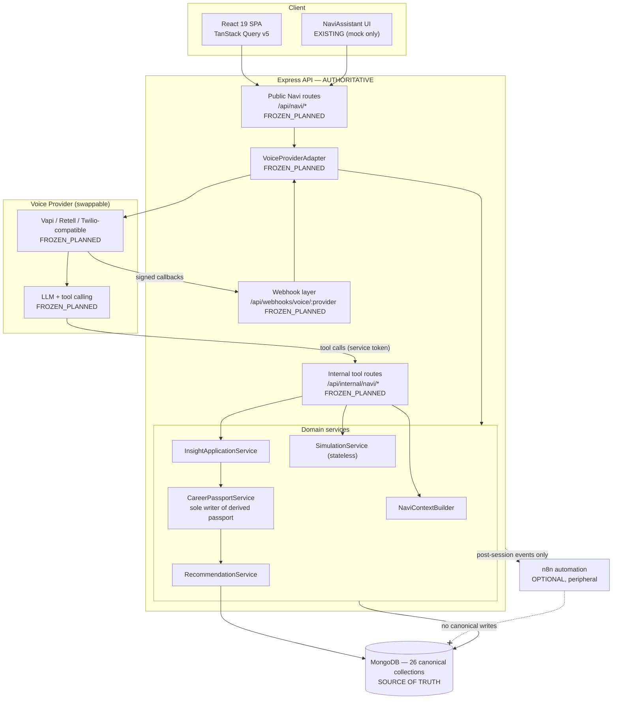
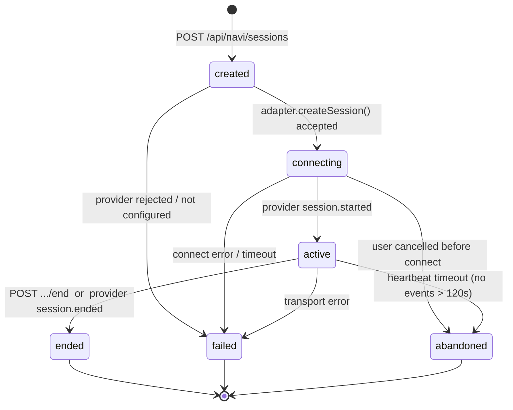
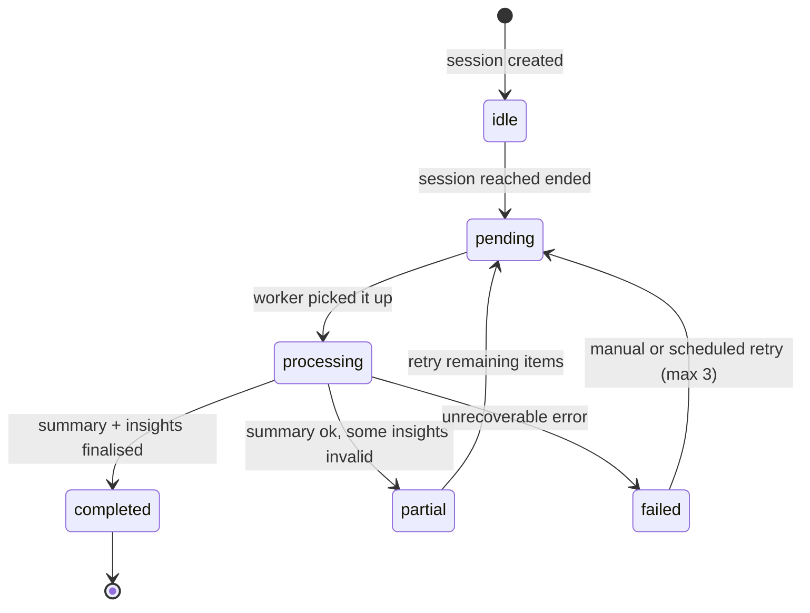
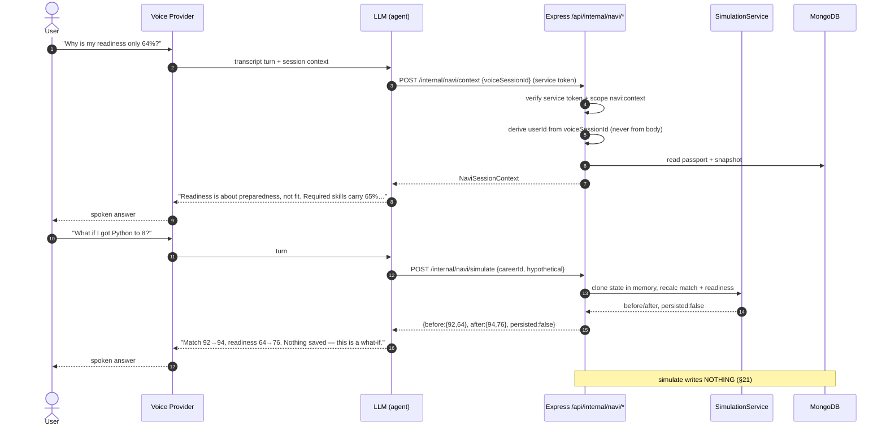
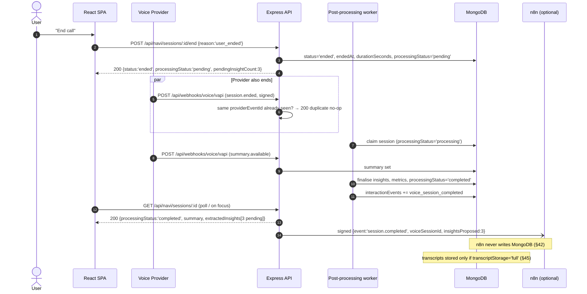

# PathSeeker — Voice Agent Integration Specification

**Contract:** `PathSeeker Navi Integration Contract v1.0`
**Document status:** FROZEN — authoritative for all voice-agent work
**Last updated:** 2026-08-26
**Owner:** PathSeeker Backend Architecture
**Audience:** Voice-agent team (independent), backend team, frontend team, automation (n8n) team, judges/reviewers

---

## 1. Document Control & Contract Version

| Field | Value |
|---|---|
| Contract version string | `PathSeeker Navi Integration Contract v1.0` |
| Career match algorithm version | `career-match-v1.0` |
| Readiness algorithm version | `readiness-v1.0` |
| Career Passport contract version | `CareerPassport v1` |
| Insight contract version | `NaviInsight v1` |
| Normalized voice event version | `NormalizedVoiceEvent v1` |
| Product theme | Career Passport |
| AI guide name | Navi |
| Stack | MERN (MongoDB + Mongoose, Express, React, Node) |
| Repository evidence date | 2026-08-26 |

Every request/response body defined in this document carries an implicit contract version. When a
breaking change is required, the version string is incremented (see §59 Contract Change Control) — it
is never silently redefined.

> **Framing rule for this entire document:** the repository is evidence of **current state**; the
> architecture defined here is the **contract for future state**. Where the two disagree, the contract
> wins and the gap is recorded — the contract is never weakened to match unfinished code.

---

## 2. Purpose and Intended Audience

This is the single authoritative integration contract that lets an **independent voice-agent team start
building immediately**, in parallel, with **none** of the following available:

- a finished frontend,
- a finished Express backend,
- a completed MongoDB migration,
- production API keys,
- a chosen voice provider (Vapi / Retell / Twilio-compatible / other).

The voice team builds against the mock API package in §49–§51. When the real endpoints land, mocks are
swapped for real base URLs. **No redesign, no contract renegotiation, no schema surprises.**

Secondary audiences:

| Audience | What they use this document for |
|---|---|
| Backend team | The exact interfaces, collections, services, and guards they must implement |
| Frontend team | Insight-approval UX contract, passport/recommendation read contracts, refresh strategy |
| Automation (n8n) team | The hard boundary of what automation may and may not own (§42) |
| Judges / reviewers | Evidence that canonical state, scoring, and privacy are owned by the application, not by an LLM |

---

## 3. Scope and Non-Goals

### In scope

- Canonical database shape (26 collections) and the legacy→target migration map.
- Career Passport, RecommendationSnapshot, VoiceSession, NaviInsight, NaviSessionContext contracts.
- Career Match v1.0 and Career Readiness v1.0 as separate, deterministic, explainable algorithms.
- Everything Navi may read, may propose, may never write.
- Public Navi REST surface, internal service-to-service tool surface, provider-neutral webhook layer.
- Session/processing state machines, idempotency, privacy, error contract, refresh strategy.
- A complete, runnable-by-hand mock API package with a canonical mock user and a canonical conversation.
- Honest status matrices derived from actual repository inspection.

### Out of scope (explicit non-goals)

| Non-goal | Reason |
|---|---|
| RAG, vector stores, embeddings, knowledge chunks | Not required in V1. Explicitly excluded (§23) |
| Persisted simulator state | Career Simulator is stateless by design (§21) |
| LLM-authored numeric scores | Scores are deterministic server calculations (§16, §17) |
| Provider-specific business logic | Business layer sees only `NormalizedVoiceEvent` (§39) |
| n8n as a state owner | n8n is peripheral automation only (§42) |
| Separate voice-side user / passport / recommendation collections | Single canonical store (§11) |
| Telephony rollout, call recording compliance program | Beyond V1 competition scope; transcripts are OPTIONAL (§45) |

### Task boundary that produced this document

This document was produced by **inspection only**. No application code, route, model, seed, `.env`, or
frontend component was modified, and no package was installed. Where implementation is missing, the gap
is **documented, not implemented**.

---

## 4. Status Label Legend

Every interface, collection, field, and endpoint in this document carries one of four labels:

| Label | Meaning | Voice team action |
|---|---|---|
| `EXISTING` | Verified present in the repository today | May be called against a running backend now |
| `FROZEN_PLANNED` | **Not implemented yet, but this is the interface everyone builds toward.** Decided, final, not negotiable | Build against the mock; swap base URL later |
| `OPTIONAL` | Permitted, not required for V1. Absence must never break the product | Do not depend on it |
| `LEGACY_TO_BE_REPLACED` | Exists today but is being replaced by a frozen target | Never integrate against it |

`FROZEN_PLANNED` is **not** a synonym for "uncertain", "proposed", or "maybe". It means the design
decision is closed and only the implementation is outstanding.

---

## 5. How To Read This Document

1. **Repository sections** (§6, §7, §13, §52–§54) describe verified reality — including defects.
2. **Contract sections** (§9–§12, §14–§51) describe the frozen target.
3. If a contract section describes something the repository lacks, that is **expected**. The gap is
   tracked in §54, not resolved by softening the contract.
4. If the repository contains something that contradicts a contract section, the repository item is
   labelled `LEGACY_TO_BE_REPLACED` and the contract stands.
5. Voice-team readers can go straight to §24–§51 and treat everything else as background. Backend
   readers should read §9–§23 and §52–§57.

---

## 6. Verified Repository Inspection Summary

All statements below were verified by reading source files in this repository on 2026-08-26.

### 6.1 What exists

| Area | Finding | Evidence |
|---|---|---|
| Backend app | Boots; Express router mounted at `/api` | [routes/index.js](backend1/src/routes/index.js) |
| Test suite | **26 tests — 25 pass, 0 fail, 1 skipped**, including an app smoke test that boots Express | `npm test` in `Project/backend1` |
| Models exported | **21** | [models/index.js](backend1/src/models/index.js) |
| Auth | Cookie session (`ps_session`), opaque token hashed into `sessions`, TTL index, no JWT | [auth.middleware.js](backend1/src/middleware/auth.middleware.js) |
| Error envelope | `{ message, code, details?, requestId }` — already matches frozen target | [error.middleware.js](backend1/src/middleware/error.middleware.js), [AppError.js](backend1/src/utils/AppError.js) |
| Request correlation | `x-request-id` echoed or generated | [requestContext.js](backend1/src/middleware/requestContext.js) |
| Success envelope | `{ data: {...}, meta?, message? }` — already matches frozen target | [catalog.controller.js](backend1/src/controllers/catalog.controller.js) |
| Pagination | Offset: `{ page, limit, skip }` / meta `{ page, limit, total, totalPages }`, maxLimit 50 | [pagination.js](backend1/src/utils/pagination.js) |
| Field allowlist precedent | `EDITABLE_FIELDS = ['headline','education','skills','interests','experience','location','goals','preferences']` | [profile.service.js](backend1/src/services/profile.service.js) |
| Only existing "intelligence" | `quiz.service.js completeAttempt()` → domain weight sum → top domain → `score` 0–100 → `archetype = "<Domain> Enthusiast"` → single `topCareerId` → `match` notification | [quiz.service.js](backend1/src/services/quiz.service.js) |
| Seed data | 10 domains, 30 skills, **6 careers**, 4 users, 3 profiles; deterministic ObjectIds; `bulkWrite` upserts | `backend1/src/database/seed/*` |
| Frontend Navi | **UI mock only** — `startConversation()` drives `setState('listening')` → `setTimeout(…'thinking', 1800)` → `setTimeout(…'speaking', 3400)`. No API call, no provider | [NaviAssistant.jsx](frontend/src/components/NaviAssistant.jsx) |
| Frontend API client | Real: `VITE_API_URL \|\| '/api'`, `credentials:'include'`, 15 s timeout, `ApiError{status,code,details,requestId}` | [apiClient.js](frontend/src/services/apiClient.js) |
| Frontend query keys | `recommendations.me()` key **already declared with no backend endpoint behind it** | [queryKeys.js](frontend/src/lib/queryKeys.js) |

### 6.2 What does not exist (verified absent)

| Missing | Verification |
|---|---|
| Any Navi / voice / provider backend code | Grep across `backend1/src` returns no navi, vapi, retell, twilio, webhook, or transcript references |
| `GET /api/users/me/passport` | Not mounted in [routes/index.js](backend1/src/routes/index.js) |
| `GET /api/users/me/recommendations` | Not mounted |
| `POST /api/careers/simulate` | Not mounted |
| `POST /api/webhooks/voice/:provider` | Not mounted |
| Any `/api/navi/*` route | Not mounted |
| `careerPassports`, `recommendationSnapshots`, `voiceSessions`, `interactionEvents`, `notes`, `learningProgress`, `contentItems`, `contentRatings`, `quizzes` models | Absent from [models/index.js](backend1/src/models/index.js) |
| `CareerPassportService`, `RecommendationService`, `InsightApplicationService`, `NaviContextBuilder` | No such files in `backend1/src/services` |
| Service-to-service auth | Only `requireAuth` / `requireRole` exist |
| Voice / LLM / provider environment variables | `backend1/.env.example` and `config/env.js` contain **zero**; `.env` key names inspected, **no secret values printed** |
| Realtime transport (WebSocket / SSE) | None. React Query invalidation + polling is the frozen fallback (§48) |

### 6.3 Verified defects (documented, deliberately not fixed)

**Defect 1 — `careers` seed silently loses most of its data.**
`new Career(careersSeed[0]).validateSync()` raises **no error**, yet the surviving keys are only
`_id, active, demand, description, domainId, expectedSalary, requiredSkills, slug, tags, title`.
Mongoose strict mode silently drops: `summary`, `requiredSkillIds`, `responsibilities`, `toolsToLearn`,
`traits`, `salaryMin`, `salaryMax`, `salaryCurrency`, `growthPercent`, `timeToJobReadyMinMonths`,
`timeToJobReadyMaxMonths`, `icon`, `tone`. Critically, **`requiredSkills.length === 0`**.
*Consequence:* there is no career↔skill graph in the database today, so the Career Match skill
component, Readiness, Skill Gap, and Navi's career explanations cannot be computed from real data.

**Defect 2 — `quizQuestions` seed is invalid against its own model.**
`new QuizQuestion(quizQuestionsSeed[0]).validateSync()` reports `questionText is required` **and**
`Quiz option keys must be unique within a question`. The seed uses `question` / `eyebrow` / `hint`
(all dropped by strict mode) and options carry `label` only with `domainWeights: []`. Seeding uses
`bulkWrite` upserts, which bypass document validators, so the invalid data lands silently.
*Consequence:* quiz scoring cannot produce real domain weights, so today's `archetype`, `score`, and
`topCareerId` are not usable passport evidence.

**Defect 3 — orphaned model.** `backend1/src/models/SavedSearch.js` exists on disk but is not exported
from `models/index.js`. It is `LEGACY_TO_BE_REPLACED` (merged into `savedFilters`, §12).

**Stale documentation warning.** `Project/BACKEND_AUDIT_AND_REMAINING_WORK.md` claims the backend
cannot boot (missing `utils/tokens.js`, `auth.controller.js.js`, routes importing `middleware/auth.js`).
That claim is **out of date**: those files no longer exist and the suite boots Express successfully.
`Project/backend1/README.md` is likewise stale where it claims no Express routes exist. Do not plan
against either statement.

---

## 7. Technology Stack (EXISTING)

| Layer | Technology | Status |
|---|---|---|
| Runtime | Node.js ≥ 20, ESM (`"type": "module"`) | `EXISTING` |
| HTTP | Express 4.21 | `EXISTING` |
| ODM | Mongoose 9 (strict mode on) | `EXISTING` |
| Database | MongoDB | `EXISTING` |
| Auth | Cookie session `ps_session`, opaque token hashed in `sessions`, TTL index | `EXISTING` |
| CSRF | Not implemented | `FROZEN_PLANNED` |
| Frontend | React 19 + Vite 8 | `EXISTING` |
| Server state | TanStack Query v5 (sole owner of server state) | `EXISTING` |
| Routing | React Router 7 | `EXISTING` |
| Client state | Zustand | `EXISTING` |
| Forms | react-hook-form + zod | `EXISTING` |
| Mocking | `msw` available in the frontend dependency tree | `EXISTING` |
| Voice provider SDK | none | `FROZEN_PLANNED` (adapter, §40) |
| LLM SDK | none | `FROZEN_PLANNED` |
| Automation | n8n (external, optional) | `OPTIONAL` (§42) |

---

## 8. System Architecture Overview



Direction of authority, stated once and enforced everywhere: **client → API → services → MongoDB.**
Providers, LLMs, and n8n hang off the side. They never sit between a service and the database.

---

## 9. Absolute Architectural Principles

These are the non-negotiable rules of the contract. Every later section is an application of them.

1. **MongoDB + Express are the only source of truth.** Every other participant holds a copy or a view.
2. **The LLM never owns canonical state.** It reads a curated context and proposes structured changes.
3. **The voice provider never owns canonical state.** It transports audio and emits events.
4. **n8n never owns canonical state.** It reacts to finished work.
5. **`CareerPassportService` is the sole writer of derived passport fields.** No controller, no webhook,
   no tool, no automation, no LLM writes them.
6. **All scores are deterministic server calculations.** An LLM may *explain* a score; it may never
   *produce* one.
7. **Navi proposes; the user approves; the server applies.** There is no path from conversation to
   canonical mutation that skips user approval.
8. **Only explicit user facts are writable via insights**, and only through the whitelist in §29.
9. **Career Match and Career Readiness are separate algorithms** with separate versions, never blended.
10. **No RAG in V1.** Structured MongoDB reads only (§23).
11. **The Career Simulator persists nothing.**
12. **`recommendationSnapshots` is append-only.** History is never overwritten.
13. **`interactionEvents` is append-only and, for the competition build, not TTL-expired.**
14. **Transcripts are OPTIONAL.** The product must be fully functional without storing raw conversation.
15. **Sensitive fields never leave the server**: `passwordHash`, refresh/session tokens, verification and
    reset tokens, audit logs, admin notes, internal security metadata, other users' private data.
16. **Service-to-service calls use a service credential, never a user's session cookie.**
17. **Every write path from the voice side is idempotent** and keyed on a provider event id.
18. **Response envelopes and error codes are stable** across mock and real implementations.

---

## 10. Canonical Database — The 26 Collections

`FROZEN_PLANNED` as a set. This list is complete and closed: **26 collections, no more, no fewer.**

| # | Collection | Group | Status today | Notes |
|---|---|---|---|---|
| 1 | `users` | AUTH | `EXISTING` | Never exposed to Navi beyond `firstName`, `role`, `status` |
| 2 | `sessions` | AUTH | `EXISTING` | Hashed opaque tokens. Never exposed to Navi |
| 3 | `verificationTokens` | AUTH | `EXISTING` | Never exposed to Navi |
| 4 | `userProfiles` | USER | `EXISTING` (incomplete) | Explicit user facts; insight write target |
| 5 | `careerPassports` | USER | **MISSING** | Derived projection, one per user, `CareerPassportService` only |
| 6 | `careers` | CAREER | `EXISTING` (incomplete) | Catalog; read-only to Navi |
| 7 | `domains` | CAREER | `EXISTING` | Read-only to Navi |
| 8 | `skills` | CAREER | `EXISTING` | Read-only to Navi |
| 9 | `quizzes` | ASSESSMENT | **MISSING** | Versioned, published versions immutable |
| 10 | `quizAttempts` | ASSESSMENT | `EXISTING` (incomplete) | Server-scored; idempotent completion |
| 11 | `recommendationSnapshots` | ASSESSMENT | **MISSING** | Append-only, immutable |
| 12 | `voiceSessions` | VOICE | **MISSING** | Navi session state; transcript optional |
| 13 | `contentItems` | CONTENT | **MISSING** | Replaces `multimedia` + `resources` |
| 14 | `contentRatings` | CONTENT | **MISSING** | Replaces `mediaRatings` |
| 15 | `learningProgress` | CONTENT | **MISSING** | Unique `userId + contentId` |
| 16 | `bookmarks` | ACTIVITY | `EXISTING` | |
| 17 | `notes` | ACTIVITY | **MISSING** | User free-text notes |
| 18 | `savedFilters` | ACTIVITY | `EXISTING` (incomplete) | Absorbs `savedSearches` |
| 19 | `recentlyViewed` | ACTIVITY | `EXISTING` | |
| 20 | `interactionEvents` | ACTIVITY | **MISSING** | Append-only, no TTL |
| 21 | `notifications` | ACTIVITY | `EXISTING` | |
| 22 | `comparisons` | ACTIVITY | `EXISTING` | |
| 23 | `successStories` | COMMUNITY | `EXISTING` | |
| 24 | `feedback` | COMMUNITY | `EXISTING` | |
| 25 | `auditLogs` | ADMIN | `EXISTING` | Never exposed to Navi |
| 26 | `settings` | ADMIN | `EXISTING` | Never exposed to Navi |

**Count check:** 3 AUTH + 2 USER + 3 CAREER + 3 ASSESSMENT + 1 VOICE + 3 CONTENT + 7 ACTIVITY +
2 COMMUNITY + 2 ADMIN = **26**.

---

## 11. Explicitly Excluded Collections

The following must **not** be created. Each is excluded by an explicit architectural decision, not by
oversight. Anyone proposing one is proposing a contract change (§59).

| Excluded | Why excluded |
|---|---|
| `vectorStores` | No RAG in V1 (§23) |
| `embeddings` | No RAG in V1 |
| `knowledgeChunks` | No RAG in V1 |
| `agentMemories` | Navi memory = `voiceSessions` + `careerPassports` + `interactionEvents`. No parallel memory store |
| `voiceAgentUsers` | One user identity: `users`. The voice side never owns identity |
| `n8nUsers` | Automation has no user table. It authenticates as a service |
| Separate voice passports (e.g. `voicePassports`) | One passport per user: `careerPassports` |
| Separate voice recommendations | One recommendation history: `recommendationSnapshots` |
| Any per-provider session table | One `voiceSessions`, discriminated by `provider` |

**Rule:** a new collection is justified only when a *visible product feature* requires independent
persistence. "The agent needs somewhere to remember things" is not such a feature.

---

## 12. Legacy → Target Migration Map

`FROZEN_PLANNED`. The voice team must integrate **only** against target names.

| Legacy (today) | Status | Target | Migration rule |
|---|---|---|---|
| `multimedia` | `LEGACY_TO_BE_REPLACED` | `contentItems` | Merge; set `kind` ∈ `video, podcast, infographic` |
| `resources` | `LEGACY_TO_BE_REPLACED` | `contentItems` | Merge; set `kind` ∈ `document, article, course, help_article` |
| `mediaRatings` | `LEGACY_TO_BE_REPLACED` | `contentRatings` | Rename + repoint `contentId` |
| `savedSearches` (orphaned file) | `LEGACY_TO_BE_REPLACED` | `savedFilters` | Merge into `{ userId, name, query, filters{domainSlugs, skillSlugs, salaryMin, salaryMax, demand}, alerts }` |
| `savedFilters` (current) | `EXISTING` (incomplete) | `savedFilters` | Extend with `query` + `alerts` |
| `quizQuestions` (mutable global) | `LEGACY_TO_BE_REPLACED` | `quizzes` | Versioned documents; published versions immutable |
| — | — | `careerPassports` | **New** |
| — | — | `recommendationSnapshots` | **New** |
| — | — | `interactionEvents` | **New** |
| — | — | `voiceSessions` | **New** |
| — | — | `notes` | **New** |
| — | — | `learningProgress` | **New**, unique `userId + contentId` |

`contentItems.kind` enum (closed): `video`, `podcast`, `document`, `article`, `course`,
`infographic`, `help_article`.

---

## 13. Existing Model Inventory vs Frozen Target

The 21 currently exported models ([models/index.js](backend1/src/models/index.js)) mapped onto the contract:

| Existing model | Maps to | Status |
|---|---|---|
| `User` | `users` | `EXISTING` |
| `Session` | `sessions` | `EXISTING` |
| `VerificationToken` | `verificationTokens` | `EXISTING` |
| `UserProfile` | `userProfiles` | `EXISTING`, incomplete |
| `Career` | `careers` | `EXISTING`, incomplete |
| `Domain` | `domains` | `EXISTING` |
| `Skill` | `skills` | `EXISTING` |
| `QuizQuestion` | `quizzes` | `LEGACY_TO_BE_REPLACED` |
| `QuizAttempt` | `quizAttempts` | `EXISTING`, incomplete |
| `Multimedia` | `contentItems` | `LEGACY_TO_BE_REPLACED` |
| `Resource` | `contentItems` | `LEGACY_TO_BE_REPLACED` |
| `MediaRating` | `contentRatings` | `LEGACY_TO_BE_REPLACED` |
| `Bookmark` | `bookmarks` | `EXISTING` |
| `SavedFilter` | `savedFilters` | `EXISTING`, incomplete |
| `RecentlyViewed` | `recentlyViewed` | `EXISTING` |
| `Notification` | `notifications` | `EXISTING` |
| `Comparison` | `comparisons` | `EXISTING` |
| `SuccessStory` | `successStories` | `EXISTING` |
| `Feedback` | `feedback` | `EXISTING` |
| `AuditLog` | `auditLogs` | `EXISTING` |
| `Settings` | `settings` | `EXISTING` |

**Incompleteness detail that matters to the voice team:**

`UserProfile` ([UserProfile.js](backend1/src/models/UserProfile.js)) holds
`userId` (unique), `education[]`, `skills[{ skillId, selfRating 1–10, experienceMonths, source }]`,
`interests[]` (case-insensitively unique), `experience[]`, `location`,
`goals{ primaryGoal, desiredIncome, desiredIncomeCurrency, remotePreference, timeframeMonths }`,
`onboarding{ status, currentStep, completedAt }`, `assets{ avatar, resume }`,
`preferences{ theme, fontScale, reducedMotion, emailNotifications, recommendationNotifications, roadmapReminders, aiPersonalization }`.

`profile.preferences` today is **UI settings only**. The seven numeric work-preference scales the
passport needs (`teamwork`, `autonomy`, `remoteWork`, `stability`, `incomePriority`,
`creativityPriority`, `socialInteraction`) do **not** exist on the profile. Per this contract they live
as **passport inputs** written from approved evidence — see §29, whitelist group `preferenceSignal`.
`goals.remotePreference` (`onsite | hybrid | remote | flexible | unspecified`) is the one existing
work-preference field and is directly writable via insight.

`Career` ([Career.js](backend1/src/models/Career.js)) holds `slug` (unique), `title`, `description`,
`domainId`, `requiredSkills[{ skillId, importance: nice_to_have | important | critical }]`,
`educationPath` (String), `expectedSalary{ min, max, currency }`,
`demand: low | medium | high | very_high`, `growthRatePercent`, `iconKey`, `colorTone`, `tags[]`,
`active`. Missing versus the frozen `NaviCareer` (§27): `summary`, per-skill `minimumLevel` and numeric
importance and `category`, `educationPaths[]`, regional `salaryRanges[]`,
`demand.growthPercentage` / `asOfDate`, `dailyActivities[]`, `tools[]`, `workEnvironments[]`.

---

## 14. CareerPassport v1 Contract

`FROZEN_PLANNED`. One current document per user (`userId` unique). It is a **derived projection** —
never client-submitted, never LLM-written.

```ts
/** Contract: CareerPassport v1 — collection: careerPassports */
interface CareerPassport {
  userId: string;                       // ObjectId, unique
  version: number;                      // monotonic; increments on every recalculation

  archetype: { code: string; label: string };

  /** 0–100, derived from quiz signals + approved evidence */
  traits: {
    analyticalThinking: number;
    creativity: number;
    technicalInterest: number;
    communication: number;
    leadership: number;
    independence: number;
    entrepreneurialDrive: number;
  };

  /** 0–100 work-preference scales. Written from approved evidence, never raw LLM output */
  preferences: {
    teamwork: number;
    autonomy: number;
    remoteWork: number;
    stability: number;
    incomePriority: number;
    creativityPriority: number;
    socialInteraction: number;
  };

  domainScores: Array<{ domainId: string; score: number }>;        // 0–100

  strengths: Array<{
    skillId: string;
    score: number;                                                  // 0–100
    evidenceSources: Array<{ type: EvidenceType; sourceId: string }>;
  }>;

  skillGaps: Array<{
    skillId: string;
    targetCareerId: string;
    currentLevel: number;                                           // 1–10
    requiredLevel: number;                                          // 1–10
    gap: number;                                                    // requiredLevel - currentLevel, min 0
  }>;

  targetCareerId: string | null;

  readiness: {
    score: number;                                                  // 0–100
    algorithmVersion: 'readiness-v1.0';
    calculatedAt: string;                                           // ISO 8601
  };

  topMatches: Array<{ careerId: string; score: number }>;           // 0–100, desc

  completionPct: number;                                            // 0–100 profile completeness
  lastQuizAttemptId: string | null;

  calculation: {
    algorithmVersion: 'career-match-v1.0';
    sources: EvidenceType[];
    calculatedAt: string;
  };

  createdAt: string;
  updatedAt: string;
}

type EvidenceType =
  | 'profile'          // explicit user profile facts
  | 'quiz'             // completed quiz attempt
  | 'voice_insight'    // user-approved Navi insight
  | 'behaviour'        // interactionEvents signals
  | 'learning';        // learningProgress
```

Rules:

- Every numeric field is range-validated at the service boundary. Out-of-range input is rejected, not clamped silently.
- `version` increments **only** inside `CareerPassportService`.
- Clients cannot submit any calculated field. There is no `PATCH /api/users/me/passport` in this contract — ever.
- `readiness.algorithmVersion` and `calculation.algorithmVersion` are distinct fields precisely because the two algorithms version independently.

---

## 15. RecommendationSnapshot Contract

`FROZEN_PLANNED`. Append-only. Existing snapshots are **immutable** — corrections append a new snapshot.

```ts
/** Contract: RecommendationSnapshot v1 — collection: recommendationSnapshots */
interface RecommendationSnapshot {
  _id: string;
  userId: string;

  trigger: {
    type: 'quiz_completed'
        | 'profile_updated'
        | 'insight_approved'
        | 'target_career_changed'
        | 'learning_progress'
        | 'admin_recalculation';
    sourceId: string | null;   // quizAttemptId, insightId, voiceSessionId, contentId…
  };

  passport: {
    versionBefore: number | null;
    versionAfter: number;
    readinessBefore: number | null;
    readinessAfter: number;
  };

  recommendations: Array<{
    careerId: string;
    score: number;                       // 0–100
    components: MatchComponents;
    reasons: string[];                   // human-readable, deterministic templates
    confidence: number;                  // 0–1
  }>;

  rankedContent: Array<{
    itemId: string;
    kind: ContentKind;
    score: number;
    reasons: string[];
  }>;

  algorithmVersion: 'career-match-v1.0';
  generatedAt: string;                   // ISO 8601
}

interface MatchComponents {
  quizSignals: number;   // max 25
  skills: number;        // max 25
  interests: number;     // max 20
  preferences: number;   // max 15
  goals: number;         // max 8
  stage: number;         // max 5
  behaviour: number;     // max 2
}

type ContentKind =
  | 'video' | 'podcast' | 'document' | 'article'
  | 'course' | 'infographic' | 'help_article';
```

This is what makes the product explainable and judge-friendly: every recalculation leaves a
before/after record with component-level attribution.

---

## 16. Career Match Algorithm v1.0

`FROZEN_PLANNED`. Version string `career-match-v1.0`. Deterministic, explainable, LLM-free.

**Question answered:** *How compatible is this career with this person?*

| Component | Weight | Primary inputs |
|---|---:|---|
| Quiz / trait alignment (`quizSignals`) | **25** | `quizAttempts` domain scores → `passport.traits`, `passport.domainScores` |
| Skill alignment (`skills`) | **25** | `profile.skills[].selfRating` vs `career.requiredSkills[].minimumLevel` weighted by importance |
| Interest alignment (`interests`) | **20** | `profile.interests[]`, `career.tags[]`, `career.domainId` |
| Work preferences (`preferences`) | **15** | `passport.preferences.*`, `profile.goals.remotePreference` vs `career.workEnvironments[]` |
| Goals (`goals`) | **8** | `profile.goals.desiredIncome` / `timeframeMonths` vs `career.salaryRanges`, time-to-ready |
| Stage / education (`stage`) | **5** | `profile.education[]`, `profile.experience[]` vs `career.educationPaths[]` |
| Behaviour (`behaviour`) | **2** | `interactionEvents` (views, bookmarks, comparisons) |
| **Total** | **100** | |

Constraints:

- **Behaviour is deliberately capped at 2.** Opening a career repeatedly must not materially change its
  suitability. Any implementation where browsing moves the score by more than 2 points is non-compliant.
- Component scores are always exposed. A score without components is not a valid Match result.
- `reasons[]` are generated from deterministic templates keyed on the dominant components.
- `confidence` reflects **input coverage** (how much profile/quiz evidence exists), not model certainty.
- **Never** use an LLM to authoritatively generate the numeric score.

```json
{
  "careerId": "000000000000000000000401",
  "score": 88,
  "components": {
    "quizSignals": 22,
    "skills": 21,
    "interests": 18,
    "preferences": 13,
    "goals": 7,
    "stage": 5,
    "behaviour": 2
  },
  "reasons": [
    "Strong technical-interest alignment",
    "You already satisfy several important skills",
    "Your preferred work style aligns with this career"
  ],
  "confidence": 0.9,
  "algorithmVersion": "career-match-v1.0"
}
```

---

## 17. Career Readiness Algorithm v1.0

`FROZEN_PLANNED`. Version string `readiness-v1.0`. Implemented **separately** from Match.

**Question answered:** *How prepared is this user to enter this career today?*

| Component | Weight | Primary inputs |
|---|---:|---|
| Required skills | **65%** | `career.requiredSkills` where importance = `critical` / `important` |
| Recommended skills | **15%** | `career.requiredSkills` where importance = `nice_to_have` |
| Relevant experience | **10%** | `profile.experience[]`, `profile.skills[].experienceMonths` |
| Education alignment | **5%** | `profile.education[]` vs `career.educationPaths[]` |
| Learning progress | **5%** | `learningProgress` for content mapped to the target career |
| **Total** | **100%** | |

- Readiness is always computed **against one target career** (`passport.targetCareerId`, or an explicit
  `careerId` argument for simulation).
- The calculation must expose per-component values so Skill Gap explanations quote real numbers.
- Readiness output feeds `passport.readiness` and `passport.skillGaps`.

**Skill Gap derivation** (§20): for the target career, per skill emit
`currentLevel`, `requiredLevel`, `gap = max(0, requiredLevel − currentLevel)`, `importance`, and
`readinessImpact` (the points that closing this gap would add). Never fabricate gap percentages in React.

---

## 18. Match vs Readiness — Strict Separation Rules

| | Career Match | Career Readiness |
|---|---|---|
| Question | Compatibility — *is this me?* | Preparedness — *can I do it today?* |
| Version | `career-match-v1.0` | `readiness-v1.0` |
| Scope | Many careers, ranked | One target career |
| Weights | 25/25/20/15/8/5/2 | 65/15/10/5/5 |
| Stored at | `passport.topMatches[]`, `snapshot.recommendations[]` | `passport.readiness` |
| Typical values for the same user | AI Product Engineer **92%** | **64%** |

Hard rules:

1. Never average, blend, or substitute one for the other.
2. Never render one under the other's label. A high match with low readiness is a **feature** — it is
   exactly the insight the product sells.
3. Both must be represented consistently in backend, MongoDB, frontend, analytics, Navi explanations,
   and the Career Simulator.
4. Navi must verbally distinguish them every time it quotes numbers (§24).

---

## 19. Quiz System

`FROZEN_PLANNED`: `quizzes` + `quizAttempts`. Replaces the mutable global `quizQuestions`.

`quizzes` document: `key`, `version`, `status`, `questions[]`, scoring configuration, timestamps.
Published versions are **immutable** — editing a published quiz creates a new version.

Question types (closed enum): `single_choice`, `multiple_choice`, `slider`, `likert`, `scenario`.

`quizAttempts` persists: `userId`, `quizId`, `quizVersion`, `status`, `answers`, question snapshots
where required, `currentPosition`, timing metadata, signal scores, `archetype`, domain scores,
top career IDs, explain reasons, `scoringVersion`, `startedAt`, `completedAt`.

Rules: the frontend sends answers; **the server calculates scores**; React-supplied scoring values are
never trusted; completion is idempotent; attempt history is retained.

**Current state (`EXISTING`, incomplete):** `QuizAttempt` stores `answers[{questionId, optionKey}]`,
denormalized `archetype`, `score`, `topCareerId`, `status` — with no quiz versioning, no component
scores, no reasons. `quiz.service.js completeAttempt()` sums option `domainWeights` → top domain →
`score` → `archetype = "<Domain> Enthusiast"` → one `topCareerId`, then creates a `match` notification
("Navi found career paths that align with your latest quiz answers."). Because of Defect 2 (§6.3), the
seeded `domainWeights` are empty, so this output is not usable evidence today.

---

## 20. Skill Gap Model

`FROZEN_PLANNED`. For the selected target career, compute per skill: current level, required level,
gap, importance, impact on readiness. Surface: strongest existing skills, largest gaps, **critical**
gaps, recommended skills, resulting readiness score.

Uses normalized `skills` records only. Blocked today by Defect 1 (§6.3): `careers.requiredSkills` is
empty in seeded data, so there is no required level to compare against.

---

## 21. Career Simulator (Stateless)

`FROZEN_PLANNED`. **No new collection.** Endpoint: `POST /api/careers/simulate`.

Flow: load canonical state → clone in memory → apply hypothetical modifications → recalculate Match and
Readiness → return before/after → **persist nothing**.

Must never mutate: `userProfiles`, `careerPassports`, `quizAttempts`, `recommendationSnapshots`.

Request:

```json
{
  "careerId": "000000000000000000000401",
  "hypothetical": {
    "skills": [{ "skillId": "000000000000000000000603", "selfRating": 8 }],
    "experienceMonths": { "000000000000000000000603": 12 },
    "education": [],
    "learningProgress": []
  }
}
```

Response:

```json
{
  "data": {
    "before": { "careerId": "000000000000000000000401", "match": 92, "readiness": 64 },
    "after":  { "careerId": "000000000000000000000401", "match": 94, "readiness": 76 },
    "changes": { "match": 2, "readiness": 12 },
    "affectedCareers": [
      { "careerId": "000000000000000000000402", "matchBefore": 71, "matchAfter": 78 }
    ],
    "persisted": false,
    "algorithmVersions": { "match": "career-match-v1.0", "readiness": "readiness-v1.0" }
  },
  "message": "Simulation only — nothing was saved."
}
```

`persisted: false` is a **required** field. Navi must say the equivalent out loud every time it reports
a simulation (§24).

---

## 22. Career Passport Recalculation Triggers

`FROZEN_PLANNED`. Recalculate only after a **meaningful approved change**:

| Trigger | `trigger.type` | Notes |
|---|---|---|
| Quiz completed | `quiz_completed` | Idempotent per attempt |
| Profile updated (whitelisted fields) | `profile_updated` | Debounced |
| Navi insight **approved** | `insight_approved` | Never on proposal |
| Target career changed | `target_career_changed` | |
| Learning progress milestone | `learning_progress` | |
| Admin-forced recalculation | `admin_recalculation` | Audit-logged |

Explicitly **not** triggers: page views, career views, bookmarks, searches, an insight being
*proposed*, a voice session starting, or a simulation running.

Every recalculation: bumps `passport.version`, updates `passport.calculation.calculatedAt`, and appends
exactly one `recommendationSnapshots` document.

---

## 23. No RAG in V1 — Decision & Rationale

`FROZEN_PLANNED` — **V1 contains no RAG.**

Navi's grounding is a **structured MongoDB read**, assembled by `NaviContextBuilder` from:

1. `careerPassports` (the user's current derived state),
2. the latest `recommendationSnapshots` document (scores + components + reasons),
3. targeted `careers` / `domains` / `skills` documents,
4. `userProfiles` explicit facts,
5. optional recent `interactionEvents` summary.

Rationale:

| Reason | Detail |
|---|---|
| The data is small and structured | Tens of careers, tens of skills. A query beats a vector search |
| Explainability | A judge can trace every Navi claim to a document and a component score |
| Determinism | No retrieval variance; identical context for identical state |
| Cost and latency | No embedding pipeline, no index refresh, no re-embed on every profile edit |
| Freshness | Reads are always current; embeddings would lag approved insights |
| Scope discipline | RAG adds three collections and an ops burden for zero V1 user-visible gain |

Forbidden as a consequence: `vectorStores`, `embeddings`, `knowledgeChunks`, similarity search,
embedding jobs, and any "knowledge base" outside the 26 collections. If free-text career knowledge is
later needed, that is a v2 contract change (§59) — not an implementation detail.

---

## 24. Navi Product Role — May / May Not

`FROZEN_PLANNED`.

### Navi MAY

- Guide onboarding conversationally.
- Explain Career Passport results, including archetype, traits, and domain scores.
- Answer profile-aware questions grounded in the provided context.
- Conduct career-discovery conversations.
- **Propose** structured insights for user approval (§28).
- Explain skill gaps using real current/required levels.
- Explain recommendations by quoting stored component scores and reasons.
- Run and narrate a **stateless** simulation, always stating that nothing was saved.
- Suggest that the user set a target career — as a proposal, not an action.
- Hand off to the app UI ("open your passport to approve these").

### Navi MAY NOT

- Modify career scores.
- Modify readiness.
- Edit passport traits, preferences, domain scores, strengths, gaps, or top matches.
- Become the source of truth for anything.
- Invent numbers. If a value is absent from context, Navi says it does not have it.
- Claim a change was saved. Only the approval flow saves.
- Read or reveal any field outside the context contract (§26).
- Perform admin actions, moderation, or role changes.
- Promise outcomes ("this guarantees a job") or give medical/legal/financial advice.
- Discuss other users.

### Required verbal discipline

| Situation | Required behaviour |
|---|---|
| Quoting a match number | Say "match" and name the career |
| Quoting readiness | Say "readiness" and name the target career |
| Both in one breath | Keep them explicitly separate |
| After a simulation | "Nothing has been saved — this is a what-if" |
| After proposing an insight | "I've queued this for your approval; you decide" |
| Missing data | "I don't have that in your passport yet" |

---

## 25. NaviSessionContext Contract

`FROZEN_PLANNED`. This is the **only** payload the LLM/agent receives about the user. Built by
`NaviContextBuilder`. It is a projection: assembled per session (and refreshed on demand), never a live
database handle.

```ts
/** Contract: NaviSessionContext v1 */
interface NaviSessionContext {
  contractVersion: 'PathSeeker Navi Integration Contract v1.0';
  voiceSessionId: string;
  generatedAt: string;

  user: {
    firstName: string;          // display only
    stage: 'student' | 'graduate' | 'professional' | 'unspecified';
    onboardingStatus: 'not_started' | 'in_progress' | 'completed';
    locale: string;
  };

  profile: {
    headline: string | null;
    location: { city: string | null; country: string | null } | null;
    interests: string[];
    skills: Array<{
      skillId: string; name: string; category: string;
      selfRating: number;                  // 1–10
      experienceMonths: number | null;
      source: 'self_reported' | 'quiz' | 'voice_insight' | 'imported';
    }>;
    education: Array<{ level: string; field: string | null; status: string | null }>;
    experience: Array<{ title: string; months: number; field: string | null }>;
    goals: {
      primaryGoal: string | null;
      desiredIncome: number | null;
      desiredIncomeCurrency: string | null;
      remotePreference: 'onsite' | 'hybrid' | 'remote' | 'flexible' | 'unspecified';
      timeframeMonths: number | null;
    };
    completionPct: number;
  };

  passport: {
    version: number;
    archetype: { code: string; label: string };
    traits: CareerPassport['traits'];
    preferences: CareerPassport['preferences'];
    domainScores: Array<{ domainId: string; name: string; score: number }>;
    strengths: Array<{ skillId: string; name: string; score: number }>;
    skillGaps: Array<{
      skillId: string; name: string;
      currentLevel: number; requiredLevel: number; gap: number;
      importance: 'nice_to_have' | 'important' | 'critical';
    }>;
    targetCareer: { careerId: string; slug: string; title: string } | null;
    readiness: { score: number; algorithmVersion: 'readiness-v1.0'; calculatedAt: string };
    completionPct: number;
    calculatedAt: string;
  } | null;                                // null before the first quiz completion

  recommendations: {
    snapshotId: string;
    generatedAt: string;
    algorithmVersion: 'career-match-v1.0';
    items: Array<{
      careerId: string; slug: string; title: string;
      score: number;                       // MATCH, never readiness
      components: MatchComponents;
      reasons: string[];
      confidence: number;
    }>;
  } | null;

  careers: NaviCareer[];                   // only careers relevant to this session

  activitySummary: {
    recentCareerViews: Array<{ careerId: string; title: string; count: number }>;
    bookmarkedCareerIds: string[];
    lastQuizCompletedAt: string | null;
    lastVoiceSessionAt: string | null;
  };

  sessionMeta: {
    purpose: VoiceSessionPurpose;
    previousSessionSummary: string | null;  // prior session summary only, never raw transcript
    pendingInsightCount: number;
  };

  policy: {
    ragEnabled: false;                      // always false in V1
    transcriptStorage: 'disabled' | 'summary_only' | 'full';
    maxInsightsPerSession: number;          // default 8
    minInsightConfidence: number;           // default 0.6
  };
}
```

Rules: the context is **read-only** to the agent; it contains no ids the agent is not allowed to
reference; it is regenerated (not patched) after any approval; and it never includes another user's data.

---

## 26. Data Navi May See / Must Never See

`FROZEN_PLANNED`.

### MAY see (via `NaviSessionContext` only)

`users.firstName`, stage, onboarding status, locale; whitelisted `userProfiles` fields; the full
`careerPassports` projection; the latest `recommendationSnapshots` items with components and reasons;
`careers` / `domains` / `skills` catalog data; a bounded activity summary; the previous session's
**summary**; and its own session metadata.

### MUST NEVER see

| Never sent | Why |
|---|---|
| `users.passwordHash` | Credential material |
| `sessions.*` (session tokens, cookies) | Session hijacking risk |
| `verificationTokens.*`, reset tokens | Account-takeover risk |
| Refresh tokens, any bearer/service secret | Credential material |
| `auditLogs.*` | Internal security record |
| Admin notes, moderation state, internal flags | Internal-only |
| `users.email`, phone, exact address | Not needed for guidance; PII minimisation |
| `users.role`, `users.status` beyond the coarse `stage` | Privilege information |
| Any other user's data, aggregates that identify others | Privacy |
| Raw internal exception details, stack traces, connection strings, env values | Leakage |
| Raw transcripts of other sessions | Privacy (§45) |

Enforcement: `NaviContextBuilder` builds by **explicit field selection (allowlist)**, never by
`toObject()` / spread of a Mongoose document. Any new field is invisible to Navi until it is added to
the allowlist on purpose. A contract test must assert the forbidden key set is absent from the built
context.

---

## 27. Career Data Exposed to Navi (`NaviCareer`)

`FROZEN_PLANNED`.

```ts
interface NaviCareer {
  careerId: string;
  slug: string;
  title: string;
  summary: string;                         // MISSING in current Career model
  domain: { domainId: string; name: string };
  requiredSkills: Array<{
    skillId: string; name: string;
    category: string;                      // MISSING today
    importance: 'nice_to_have' | 'important' | 'critical';
    importanceWeight: number;              // MISSING today (numeric form)
    minimumLevel: number;                  // 1–10, MISSING today
  }>;
  educationPaths: string[];                // today: single `educationPath` string
  salaryRanges: Array<{                    // today: single expectedSalary{min,max,currency}
    region: string; currency: string; min: number; max: number; period: 'year' | 'month';
  }>;
  demand: {
    level: 'low' | 'medium' | 'high' | 'very_high';
    growthPercentage: number | null;       // today: flat growthRatePercent
    asOfDate: string | null;               // MISSING today
  };
  dailyActivities: string[];               // MISSING today
  tools: string[];                         // MISSING today
  workEnvironments: string[];              // MISSING today
  tags: string[];
}
```

Until the `careers` model and seed are completed (Defect 1, §6.3), the mock fixtures in §50 are the
**only** source of a complete `NaviCareer`. The voice team must build against the mock shape, not
against what today's `GET /api/careers/:slug` returns.

---

## 28. NaviInsight Contract

`FROZEN_PLANNED`. An insight is a **proposal about an explicit user fact**. It is never a calculated
value and never applied on arrival.

```ts
/** Contract: NaviInsight v1 */
interface NaviInsight {
  insightId: string;                 // server-generated
  voiceSessionId: string;
  target: InsightTarget;             // whitelist only (§29)
  operation: 'set' | 'add' | 'remove';
  value: string | number | boolean | Record<string, unknown>;
  previousValue: string | number | boolean | Record<string, unknown> | null;
  confidence: number;                // 0–1; below policy.minInsightConfidence → rejected
  evidence: {
    quote: string;                   // short paraphrase/quote justifying the insight
    turnIndex: number;
    extractedAt: string;
  };
  displayLabel: string;              // user-facing, e.g. "Update Python self-rating from 4 to 6"
  status: 'pending' | 'approved' | 'rejected' | 'expired' | 'superseded';
  approvedAt: string | null;
  appliedAt: string | null;
  rejectedReason: string | null;
}
```

Server validation, in order:

1. `target` is on the whitelist (§29). Otherwise `NAVI_INSIGHT_TARGET_FORBIDDEN` (403).
2. Shape and type match the target's declared type. Otherwise `NAVI_INSIGHT_INVALID` (422).
3. Value is within the target's range/enum. Otherwise `NAVI_INSIGHT_INVALID` (422).
4. `confidence ≥ policy.minInsightConfidence`. Otherwise `NAVI_INSIGHT_LOW_CONFIDENCE` (422).
5. `evidence.quote` non-empty. Otherwise `NAVI_INSIGHT_INVALID` (422).
6. Session insight count < `policy.maxInsightsPerSession`. Otherwise `NAVI_SESSION_LIMIT_REACHED` (429).
7. A pending insight for the same `target` is marked `superseded` by the new one.

Accepted insights are stored `pending` on the `voiceSessions` document and mirrored in the API response.
**Storing an insight changes no canonical state.**

---

## 29. Insight Target Whitelist

`FROZEN_PLANNED`. This list is **exhaustive**. Anything not listed is forbidden.

| `target` | Type / range | Op(s) | Writes to |
|---|---|---|---|
| `profile.skills[].selfRating` | int 1–10 (+ `skillId`) | `set` | `userProfiles.skills[]`, `source = 'voice_insight'` |
| `profile.skills[]` | `{ skillId, selfRating 1–10, experienceMonths? }` | `add`, `remove` | `userProfiles.skills[]` |
| `profile.skills[].experienceMonths` | int ≥ 0 (+ `skillId`) | `set` | `userProfiles.skills[]` |
| `profile.interests[]` | string (ci-unique) | `add`, `remove` | `userProfiles.interests[]` |
| `profile.goals.primaryGoal` | string ≤ 280 | `set` | `userProfiles.goals` |
| `profile.goals.desiredIncome` | number ≥ 0 | `set` | `userProfiles.goals` |
| `profile.goals.desiredIncomeCurrency` | ISO-4217 | `set` | `userProfiles.goals` |
| `profile.goals.remotePreference` | `onsite\|hybrid\|remote\|flexible\|unspecified` | `set` | `userProfiles.goals` |
| `profile.goals.timeframeMonths` | int 1–120 | `set` | `userProfiles.goals` |
| `profile.education[]` | `{ level, field?, status? }` | `add`, `remove` | `userProfiles.education[]` |
| `profile.experience[]` | `{ title, months, field? }` | `add`, `remove` | `userProfiles.experience[]` |
| `profile.location` | `{ city?, country? }` | `set` | `userProfiles.location` |
| `passportInput.preferenceSignal` | `{ key ∈ teamwork\|autonomy\|remoteWork\|stability\|incomePriority\|creativityPriority\|socialInteraction, level 0–100 }` | `set` | **Evidence input** consumed by `CareerPassportService`; never a direct write to `passport.preferences` |
| `targetCareerId` | existing `careers._id`, `active: true` | `set` | `careerPassports.targetCareerId` via `CareerPassportService` |
| `notes[]` | `{ body ≤ 2000, careerId? }` | `add` | `notes` |

Notes:

- `passportInput.preferenceSignal` is the deliberate bridge for the seven numeric scales that do not
  exist on `userProfiles` today (§13). Navi supplies **evidence**; the service decides the stored value.
- `targetCareerId` is the single exception where an insight touches the passport document — and even
  then only through `CareerPassportService`, which then recalculates readiness.
- Every applied insight appends an `evidenceSources` entry of type `voice_insight` with the insight id.

---

## 30. Forbidden Insight Targets

`FROZEN_PLANNED`. Requests naming any of these are rejected with `NAVI_INSIGHT_TARGET_FORBIDDEN` (403)
and logged.

| Forbidden target | Category |
|---|---|
| `careerPassports.traits.*` | Derived |
| `careerPassports.preferences.*` (direct write) | Derived — use `passportInput.preferenceSignal` |
| `careerPassports.domainScores[]` | Derived |
| `careerPassports.strengths[]` | Derived |
| `careerPassports.skillGaps[]` | Derived |
| `careerPassports.topMatches[]` | Derived |
| `careerPassports.readiness.*` | Derived |
| `careerPassports.version`, `careerPassports.calculation.*` | Service-owned |
| `careerPassports.completionPct` | Derived |
| `recommendationSnapshots.*` | Immutable history |
| `quizAttempts.score` / `archetype` / `domainScores` / `topCareerIds` / `status` | Server-scored |
| `quizzes.*` | Versioned content |
| `users.role`, `users.status`, `users.email`, `users.emailVerified`, `users.passwordHash` | Security |
| `sessions.*`, `verificationTokens.*` | Security |
| `auditLogs.*` | Append-only security record |
| `settings.*` | Admin |
| `careers.*`, `domains.*`, `skills.*` | Catalog content |
| `feedback.status`, `successStories.status` | Moderation |
| `contentItems.*` | Admin content |
| Any raw MongoDB path, aggregation, or `$`-operator payload | Escape hatch |

---

## 31. Insight Approval Pipeline

`FROZEN_PLANNED`. The only path from conversation to canonical state.

```text
Conversation turn
   ↓
Navi extracts candidate insight  (POST /api/internal/navi/insights)
   ↓
Server validates target / shape / range / confidence / evidence   ← §28
   ↓
Insight stored as `pending` on voiceSessions.extractedInsights[]
   ↓
User sees pending insights in the app  (GET /api/navi/sessions/:id)
   ↓
User approves or rejects  (POST /api/navi/sessions/:id/approve-insights)
   ↓
InsightApplicationService writes ONLY whitelisted explicit facts + evidence
   ↓
CareerPassportService recalculates  → passport.version++
   ↓
RecommendationService recalculates
   ↓
RecommendationSnapshot appended (trigger.type = 'insight_approved')
   ↓
interactionEvents appended; notification created; React Query keys invalidated
```

Explicitly forbidden shortcuts:

```text
Navi  →  careerPassports.update()                 ✗
Navi  →  userProfiles.update()                    ✗ (must pass approval)
Webhook → careerPassports.update()                ✗
n8n   →  any canonical write                      ✗
Auto-approval of insights without a user decision ✗
```

Rejection is a first-class outcome: `status = 'rejected'` with `rejectedReason`, no canonical write, no
recalculation, and the rejection is retained as signal for prompt tuning.

---

## 32. Forbidden Agent Tools

`FROZEN_PLANNED`. These tool names must **never** exist in any agent/provider configuration. Their
absence is a review checklist item (§55).

| Forbidden tool | Why it is forbidden |
|---|---|
| `updatePassport` | Passport writes belong to `CareerPassportService` only |
| `setCareerScore` | Match scores are deterministic server calculations |
| `setReadiness` | Readiness is a deterministic server calculation |
| `updateMongoDocument` | Arbitrary write escape hatch |
| `executeMongoQuery` | Arbitrary read escape hatch; bypasses the context allowlist |
| `updateUserRole` | Privilege escalation |
| `setTopCareer` | Ranking is derived, not asserted |

Additional prohibitions, same rule: any tool that writes calculated fields, any tool taking a raw
collection name or query object, any tool that bypasses approval, any tool that can read arbitrary
users, and any tool that returns secrets or env values.

The complete permitted tool set is exactly the five tools in §36. Anything else is a contract change.

---

## 33. VoiceSession Contract

`FROZEN_PLANNED`. Collection: `voiceSessions`. This is the canonical record of a Navi session — and the
**identity anchor** for every service-to-service call (§37).

```ts
/** Contract: VoiceSession v1 — collection: voiceSessions */
interface VoiceSession {
  _id: string;                       // voiceSessionId — the id everyone quotes
  userId: string;

  provider: VoiceProvider;
  providerSessionId: string | null;  // set once the provider confirms; null for local fallback

  purpose: VoiceSessionPurpose;
  status: VoiceSessionStatus;

  startedAt: string | null;
  endedAt: string | null;
  durationSeconds: number | null;

  summary: string | null;            // short, user-safe recap; always allowed

  transcript?: Array<{               // OPTIONAL — only when policy allows (§45)
    turnIndex: number;
    role: 'navi' | 'user';
    text: string;
    at: string;
  }>;

  extractedInsights: NaviInsight[];  // pending / approved / rejected / expired / superseded

  processingStatus: ProcessingStatus; // INDEPENDENT of `status` (§34)

  metrics: {
    turnCount: number;
    toolCallCount: number;
    insightsProposed: number;
    insightsApproved: number;
  };

  lastEventId: string | null;        // provider event id, for idempotency (§44)
  errorCode: string | null;

  createdAt: string;
  updatedAt: string;
}

type VoiceProvider = 'vapi' | 'retell' | 'twilio' | 'local_text';

type VoiceSessionPurpose =
  | 'onboarding'
  | 'passport_explanation'
  | 'career_discovery'
  | 'skill_gap_review'
  | 'recommendation_review'
  | 'general';

type VoiceSessionStatus =
  | 'created' | 'connecting' | 'active'
  | 'ended' | 'failed' | 'abandoned';

type ProcessingStatus =
  | 'idle' | 'pending' | 'processing'
  | 'completed' | 'partial' | 'failed';
```

Indexes (`FROZEN_PLANNED`): `{ userId, createdAt: -1 }`, `{ provider, providerSessionId }` unique-sparse,
`{ status }`, `{ processingStatus }`, `{ 'extractedInsights.status' }`. **No TTL index** —
voice sessions are product history, not cache.

---

## 34. Session State Machine + Processing State Machine

`FROZEN_PLANNED`. `status` (conversation lifecycle) and `processingStatus` (post-call server work) are
**separate fields with separate machines**. A call can be `ended` while insights are still `processing`;
that is normal and the UI must render it.

### 34.1 Conversation lifecycle (`status`)



| Transition | Trigger | Guard |
|---|---|---|
| `created → connecting` | Adapter accepted the session | Provider configured, or `local_text` fallback |
| `created → failed` | `NAVI_PROVIDER_NOT_CONFIGURED` / `NAVI_PROVIDER_UNAVAILABLE` | — |
| `connecting → active` | `session.started` event | Signature verified |
| `active → ended` | `POST /end` or `session.ended` | Idempotent; whichever arrives first wins |
| `active → abandoned` | No event for 120 s | Sweeper job |
| any terminal → * | **Forbidden.** Returns `NAVI_SESSION_ALREADY_ENDED` (409) | — |

Terminal statuses: `ended`, `failed`, `abandoned`. They never transition again.

### 34.2 Post-session processing (`processingStatus`)



Rules: `processingStatus` never gates the user's ability to read the session; a `failed`
`processingStatus` must never corrupt the passport (recalculation is transactional per approval); and
`partial` must list which insights failed validation so the UI can explain the shortfall.

---

## 35. Public Navi REST Endpoints

`FROZEN_PLANNED` (all of them). Auth: cookie session (`requireAuth`), same as the rest of the API.
Envelopes: success `{ data, meta?, message? }`, error `{ message, code, details?, requestId }`.

| # | Method | Path | Purpose | Status |
|---|---|---|---|---|
| 1 | `POST` | `/api/navi/sessions` | Create a session; returns join credentials + full context | `FROZEN_PLANNED` |
| 2 | `GET` | `/api/navi/sessions` | Paginated session history (offset pagination, §7) | `FROZEN_PLANNED` |
| 3 | `GET` | `/api/navi/sessions/:id` | One session incl. pending insights + `processingStatus` | `FROZEN_PLANNED` |
| 4 | `POST` | `/api/navi/sessions/:id/messages` | Text turn (local fallback + accessibility path) | `FROZEN_PLANNED` |
| 5 | `POST` | `/api/navi/sessions/:id/approve-insights` | Approve/reject pending insights → recalculation | `FROZEN_PLANNED` |
| 6 | `POST` | `/api/navi/sessions/:id/end` | End the session, request processing | `FROZEN_PLANNED` |
| 7 | `GET` | `/api/users/me/passport` | Current Career Passport (read-only) | `FROZEN_PLANNED` |
| 8 | `GET` | `/api/users/me/recommendations` | Latest recommendation snapshot | `FROZEN_PLANNED` |
| 9 | `POST` | `/api/careers/simulate` | Stateless what-if (§21) | `FROZEN_PLANNED` |
| 10 | `POST` | `/api/webhooks/voice/:provider` | Provider callbacks (no user cookie; signature auth) | `FROZEN_PLANNED` |

There is deliberately **no** `PATCH /api/users/me/passport` and **no** endpoint that accepts a score.

### 35.1 `POST /api/navi/sessions`

Request:

```json
{ "purpose": "passport_explanation", "preferredProvider": "vapi", "clientRequestId": "c1f0a9e2-uuid" }
```

`purpose` required; `preferredProvider` optional (server may override); `clientRequestId` optional
idempotency key (§44).

Response `201`:

```json
{
  "data": {
    "voiceSessionId": "000000000000000000000301",
    "provider": "vapi",
    "status": "connecting",
    "processingStatus": "idle",
    "join": {
      "mode": "webrtc",
      "publicKey": "pk_mock_public_only",
      "assistantId": "asst_mock_navi",
      "clientToken": "ephemeral-mock-token",
      "expiresAt": "2026-08-26T10:05:00.000Z"
    },
    "context": { "…": "NaviSessionContext v1 — see §25" },
    "policy": { "ragEnabled": false, "transcriptStorage": "summary_only", "maxInsightsPerSession": 8, "minInsightConfidence": 0.6 }
  },
  "message": "Navi session created."
}
```

`join.clientToken` is **short-lived and provider-scoped**. It is never a PathSeeker session token and
grants no API access.

When no provider is configured the server returns `provider: "local_text"` with
`join.mode: "text"` — the UI stays functional (§41).

### 35.2 `GET /api/navi/sessions`

Query: `page` (default 1), `limit` (default 20, max 50), `status?`, `purpose?`.

```json
{
  "data": { "sessions": [ { "voiceSessionId": "000000000000000000000301", "purpose": "passport_explanation", "provider": "vapi", "status": "ended", "processingStatus": "completed", "startedAt": "2026-08-26T09:58:00.000Z", "endedAt": "2026-08-26T10:04:12.000Z", "durationSeconds": 372, "summary": "Reviewed readiness and agreed to update Python.", "insightsProposed": 3, "insightsApproved": 2 } ] },
  "meta": { "page": 1, "limit": 20, "total": 1, "totalPages": 1 }
}
```

### 35.3 `GET /api/navi/sessions/:id`

Returns the `VoiceSession` projection: `status`, `processingStatus`, `summary`, `metrics`,
`extractedInsights[]` (with `displayLabel`, `previousValue`, `confidence`, `evidence.quote`), and
`transcript` **only** when `policy.transcriptStorage === 'full'` and the caller owns the session.
`404 NAVI_SESSION_NOT_FOUND` if the session belongs to another user — never `403`, to avoid confirming
existence.

### 35.4 `POST /api/navi/sessions/:id/messages`

Request: `{ "text": "Why is my readiness only 64%?", "clientRequestId": "uuid" }`

Response `200`:

```json
{
  "data": {
    "turnIndex": 3,
    "reply": { "role": "navi", "text": "Your readiness for AI Product Engineer is 64% …", "at": "2026-08-26T10:00:12.000Z" },
    "proposedInsights": [],
    "toolCalls": [ { "tool": "simulateChange", "status": "skipped" } ],
    "session": { "status": "active", "processingStatus": "idle", "pendingInsightCount": 0 }
  }
}
```

Rejects with `NAVI_SESSION_ALREADY_ENDED` (409) on terminal sessions.

### 35.5 `POST /api/navi/sessions/:id/approve-insights`

Request:

```json
{
  "decisions": [
    { "insightId": "000000000000000000000701", "decision": "approve" },
    { "insightId": "000000000000000000000702", "decision": "approve" },
    { "insightId": "000000000000000000000703", "decision": "reject", "reason": "Not accurate" }
  ],
  "clientRequestId": "approve-uuid-1"
}
```

Response `200` — the canonical "something actually changed" response:

```json
{
  "data": {
    "applied": [ "000000000000000000000701", "000000000000000000000702" ],
    "rejected": [ "000000000000000000000703" ],
    "passport": { "versionBefore": 7, "versionAfter": 8, "readinessBefore": 64, "readinessAfter": 71 },
    "recommendationSnapshotId": "000000000000000000000202",
    "recalculated": true,
    "invalidateQueryKeys": [ ["passport","me"], ["recommendations","me"], ["profile","me"], ["navi","sessions"] ]
  },
  "message": "2 insights applied. Your Career Passport was updated."
}
```

Partial failure returns `200` with the successful subset plus
`details.failed[] = [{ insightId, code }]`. Approving an already-resolved insight returns
`NAVI_INSIGHT_ALREADY_RESOLVED` (409) for that entry only.

### 35.6 `POST /api/navi/sessions/:id/end`

Request: `{ "reason": "user_ended" }` — `user_ended | provider_ended | timeout | error`.

```json
{
  "data": {
    "voiceSessionId": "000000000000000000000301",
    "status": "ended",
    "processingStatus": "pending",
    "durationSeconds": 372,
    "pendingInsightCount": 3,
    "summary": null
  },
  "message": "Session ended. Navi is preparing your summary."
}
```

Idempotent: ending an already-ended session returns `200` with the same body (not an error), because the
provider webhook and the user may both end it.

### 35.7 `GET /api/users/me/passport`

`200` → `{ "data": { "passport": CareerPassport } }`.
`404 PASSPORT_NOT_READY` when the user has not completed a quiz yet — with
`details.nextStep: "complete_quiz"`.

### 35.8 `GET /api/users/me/recommendations`

`200` → `{ "data": { "snapshot": RecommendationSnapshot } }`, latest by `generatedAt`.
Query `?snapshotId=` returns a specific historical snapshot. `?history=true` returns the paginated list
of snapshot headers. Note: [queryKeys.js](frontend/src/lib/queryKeys.js) already declares
`recommendations.me()` — this endpoint is what fills it.

---

## 36. Internal Navi Tool Endpoints

`FROZEN_PLANNED`. These are the **only five tools** the agent may call. Base path `/api/internal/navi/*`.
Auth: service credential (§37) — **never** a user cookie. Every request carries `voiceSessionId`, and the
server derives `userId` from it. **No endpoint accepts a `userId` parameter.**

| # | Tool name | Method + path | Reads | Writes |
|---|---|---|---|---|
| 1 | `getContext` | `POST /api/internal/navi/context` | passport, profile, snapshot, careers | nothing |
| 2 | `searchCareers` | `POST /api/internal/navi/careers/search` | `careers`, `domains`, `skills` | nothing |
| 3 | `simulateChange` | `POST /api/internal/navi/simulate` | canonical state (in-memory clone) | **nothing** |
| 4 | `proposeInsight` | `POST /api/internal/navi/insights` | whitelist validation | `voiceSessions.extractedInsights[]` as `pending` only |
| 5 | `recordEvent` | `POST /api/internal/navi/events` | — | `interactionEvents`, session `summary` / `metrics` / optional transcript turn |

### 36.1 `getContext`

```json
{ "voiceSessionId": "000000000000000000000301", "include": ["passport","recommendations","careers","activity"] }
```
→ `{ "data": { "context": NaviSessionContext } }`. Returns `NAVI_CONTEXT_UNAVAILABLE` (424) when the
passport does not exist yet **and** the agent requested `passport`; the agent must then run
onboarding-style discovery instead of inventing values.

### 36.2 `searchCareers`

```json
{ "voiceSessionId": "…", "query": "AI product", "domainSlug": null, "skillSlugs": ["python"], "limit": 5 }
```
→ `{ "data": { "careers": NaviCareer[] } }`. Structured filters only — no free-text vector search
(§23). `limit` max 10, to bound prompt size.

### 36.3 `simulateChange`

Same body as §21 plus `voiceSessionId`. Response is the §21 payload including `persisted: false`.
This tool is **read-only by contract**; an implementation that writes anything here is non-compliant.

### 36.4 `proposeInsight`

```json
{
  "voiceSessionId": "000000000000000000000301",
  "insights": [
    { "target": "profile.skills[].selfRating", "operation": "set",
      "value": { "skillId": "000000000000000000000603", "selfRating": 6 },
      "confidence": 0.86,
      "evidence": { "quote": "I've been doing Python daily at my internship for four months", "turnIndex": 4 } }
  ]
}
```

Response `201`:

```json
{
  "data": {
    "accepted": [ { "insightId": "000000000000000000000701", "status": "pending", "displayLabel": "Update Python self-rating from 4 to 6" } ],
    "rejected": [],
    "pendingInsightCount": 1,
    "requiresUserApproval": true
  },
  "message": "Insight queued for user approval."
}
```

`requiresUserApproval: true` is **always** returned. There is no flag, header, or scope that makes it false.

### 36.5 `recordEvent`

```json
{
  "voiceSessionId": "…",
  "events": [
    { "name": "voice_session_started", "at": "2026-08-26T09:58:00.000Z", "properties": { "purpose": "passport_explanation" } }
  ],
  "summary": null,
  "transcriptTurn": null
}
```

`name` must be from the closed list in §46. Unknown names are rejected (`VALIDATION_ERROR`, 422) rather
than stored — the event stream stays queryable. `transcriptTurn` is silently ignored (with
`details.transcriptStored: false`) when `policy.transcriptStorage !== 'full'`; when the caller explicitly
demands storage it is `NAVI_TRANSCRIPT_DISABLED` (403).

---

## 37. Service-to-Service Authentication

`FROZEN_PLANNED`. There is **no** service-to-service auth in the repository today (§6.2).

### Rules

1. **Never reuse a user's session cookie for machine calls.** Not in the provider, not in the LLM tool
   layer, not in n8n. `ps_session` is browser-only.
2. Internal tool calls authenticate with a **service credential**:
   `Authorization: Bearer <PATHSEEKER_SERVICE_TOKEN>` plus `X-PathSeeker-Service: navi-agent`.
3. **User identity is derived from `voiceSessionId`, never supplied.** The server loads the session,
   reads `session.userId`, and scopes every read/write to that user. A `userId` in the body is a
   validation error, not an override.
4. Service tokens are **scoped**: `navi:context`, `navi:careers`, `navi:simulate`, `navi:insights`,
   `navi:events`. Missing scope → `NAVI_SERVICE_SCOPE_DENIED` (403).
5. Tokens are environment-provided, rotatable, and never committed. `.env.example` gains key **names**
   only. (Verified today: no such variables exist.)
6. Internal routes are mounted under `/api/internal/*`, rate-limited per service token, and — in
   production — network-restricted. They are excluded from the public API docs.
7. `voiceSessionId` in a terminal status rejects tool calls with `NAVI_SESSION_ALREADY_ENDED` (409), so a
   leaked id has a bounded blast radius.
8. Every internal call is logged with `requestId`, service name, tool name, and `voiceSessionId` —
   never with the token.

### Environment variable names (`FROZEN_PLANNED`, names only — no values)

```text
NAVI_ENABLED
NAVI_PROVIDER                    # vapi | retell | twilio | local_text
NAVI_TRANSCRIPT_STORAGE          # disabled | summary_only | full
NAVI_MAX_INSIGHTS_PER_SESSION
NAVI_MIN_INSIGHT_CONFIDENCE
PATHSEEKER_SERVICE_TOKEN
PATHSEEKER_SERVICE_TOKEN_PREVIOUS   # rotation window
VOICE_WEBHOOK_SECRET
VOICE_PROVIDER_API_KEY
VOICE_PROVIDER_ASSISTANT_ID
VOICE_PROVIDER_PUBLIC_KEY
LLM_API_KEY
LLM_MODEL
N8N_WEBHOOK_URL
N8N_SHARED_SECRET
```

---

## 38. Provider-Neutral Webhook Contract

`FROZEN_PLANNED`. `POST /api/webhooks/voice/:provider` where `:provider` ∈
`vapi | retell | twilio | local_text`. Unknown provider → `NAVI_WEBHOOK_UNKNOWN_PROVIDER` (404).

Processing order — **fixed, and each step is a gate**:

1. Read the raw body (signature verification needs bytes, not a re-serialized object).
2. `adapter.verifyWebhook(rawBody, headers)` → invalid ⇒ `NAVI_WEBHOOK_SIGNATURE_INVALID` (401).
3. Timestamp skew check (±5 min) ⇒ `NAVI_WEBHOOK_REPLAY_DETECTED` (409).
4. `providerEventId` seen before ⇒ **`200` no-op** with `code: NAVI_EVENT_DUPLICATE` (§44).
5. `adapter.normalizeWebhook(...)` → `NormalizedVoiceEvent`.
6. Resolve `voiceSessionId` from `providerSessionId`; unknown ⇒ `200` + `NAVI_SESSION_NOT_FOUND` in
   `details` (never retry-loop a provider on an unmatched session).
7. Dispatch to domain services by `event.type`.
8. Persist `lastEventId`, respond `200` **fast** (< 1 s). Slow work goes to `processingStatus`.

Response is always the same shape so provider retry logic stays simple:

```json
{ "data": { "received": true, "voiceSessionId": "000000000000000000000301", "eventType": "session.ended", "duplicate": false } }
```

**The webhook layer performs no business logic itself.** It verifies, normalizes, and dispatches. It
never writes `careerPassports`, never applies insights, and never bypasses approval.

---

## 39. NormalizedVoiceEvent Contract

`FROZEN_PLANNED`. Everything past the adapter sees **only** this shape. No provider payload field name
may appear in any service.

```ts
/** Contract: NormalizedVoiceEvent v1 */
interface NormalizedVoiceEvent {
  contractVersion: 'PathSeeker Navi Integration Contract v1.0';
  provider: VoiceProvider;
  providerEventId: string;           // idempotency key (§44)
  providerSessionId: string;
  voiceSessionId: string | null;     // resolved server-side
  type: NormalizedVoiceEventType;
  occurredAt: string;                // ISO 8601, provider clock
  receivedAt: string;                // ISO 8601, server clock
  payload: NormalizedVoiceEventPayload;
  raw?: unknown;                     // OPTIONAL, debug builds only; never persisted in production
}

type NormalizedVoiceEventType =
  | 'session.started'
  | 'session.ended'
  | 'session.failed'
  | 'transcript.partial'      // never persisted
  | 'transcript.final'        // persisted only when transcriptStorage === 'full'
  | 'insight.proposed'        // → pending only
  | 'summary.available'
  | 'tool.called'
  | 'error';

type NormalizedVoiceEventPayload =
  | { kind: 'session'; startedAt?: string; endedAt?: string; durationSeconds?: number; endedReason?: string }
  | { kind: 'transcript'; turnIndex: number; role: 'navi' | 'user'; text: string; isFinal: boolean }
  | { kind: 'insight'; insights: Array<Omit<NaviInsight, 'insightId' | 'voiceSessionId' | 'status' | 'approvedAt' | 'appliedAt' | 'rejectedReason' | 'previousValue' | 'displayLabel'>> }
  | { kind: 'summary'; summary: string; turnCount: number }
  | { kind: 'tool'; tool: string; argumentsRedacted: Record<string, unknown>; outcome: 'ok' | 'error' }
  | { kind: 'error'; code: string; message: string; retryable: boolean };
```

Event → action map:

| `type` | Server action | Canonical write? |
|---|---|---|
| `session.started` | `status: connecting → active`, `startedAt`, event `voice_session_started` | session only |
| `session.ended` | `status → ended`, duration, `processingStatus → pending`, event `voice_session_completed` | session only |
| `session.failed` | `status → failed`, `errorCode` | session only |
| `transcript.partial` | Ignored (never stored) | no |
| `transcript.final` | Stored only if `transcriptStorage === 'full'` | session only |
| `insight.proposed` | Validate (§28) → store `pending` | **no** |
| `summary.available` | Set `summary`, `processingStatus → completed` | session only |
| `tool.called` | `metrics.toolCallCount++`, audit line | session only |
| `error` | `errorCode`, optionally `status → failed` | session only |

Note what is absent from that column: **no webhook event ever writes the passport, a score, or a
profile fact.** The only route to those is user approval (§31).

---

## 40. VoiceProviderAdapter Interface

`FROZEN_PLANNED`. One file per provider, one registry, zero provider names in business code.

```ts
interface VoiceProviderAdapter {
  readonly name: VoiceProvider;
  readonly capabilities: {
    realtimeVoice: boolean;
    textFallback: boolean;
    serverToolCalls: boolean;
    providerSummary: boolean;
    transcripts: boolean;
  };

  createSession(input: {
    voiceSessionId: string;
    purpose: VoiceSessionPurpose;
    context: NaviSessionContext;
    toolEndpointBaseUrl: string;
  }): Promise<{
    providerSessionId: string | null;
    join: { mode: 'webrtc' | 'sip' | 'text'; publicKey?: string; assistantId?: string; clientToken?: string; expiresAt?: string };
  }>;

  endSession(input: { providerSessionId: string; reason: string }): Promise<void>;

  verifyWebhook(input: { rawBody: Buffer; headers: Record<string, string> }): { valid: boolean; reason?: string };

  normalizeWebhook(input: { rawBody: Buffer; headers: Record<string, string> }): NormalizedVoiceEvent[];
}
```

Rules: adding a provider means adding one adapter and one env value — **no service, controller, model,
or frontend change**. `capabilities` drives graceful degradation (e.g. a provider without
`providerSummary` gets a server-generated summary). Adapter selection: `NAVI_PROVIDER`, falling back to
`local_text` when the selected provider's key is absent.

---

## 41. Local Text-Navi Fallback

`FROZEN_PLANNED` and **mandatory**. If no external provider is configured, Navi must still work.

`provider: 'local_text'` gives the same `voiceSessions` document, the same
`POST /api/navi/sessions/:id/messages` turn loop, the same insight extraction interface, and the same
approval pipeline — only the transport differs (`join.mode: 'text'`).

Consequences:

- The Navi UI is **never** broken by a missing API key. `NAVI_PROVIDER_NOT_CONFIGURED` (501) is returned
  only when a caller explicitly demands an unconfigured provider via `preferredProvider`.
- The competition demo runs end-to-end with zero paid keys.
- The voice team can validate the entire insight→approval→recalculation loop before any provider exists.
- The frontend's existing `setTimeout`-driven mock ([NaviAssistant.jsx](frontend/src/components/NaviAssistant.jsx))
  is replaced by real `local_text` calls; the state names (`listening` / `thinking` / `speaking`) map onto
  request lifecycle states and may be kept.

Secrets are never committed. Providers are selected by environment-based adapters only.

---

## 42. n8n Boundary

`OPTIONAL`. n8n may exist; the product must be fully functional without it.

### n8n MAY

| Allowed | Example |
|---|---|
| Asynchronous follow-up | "You haven't finished your quiz" nudge 48 h later |
| Email / notification delivery | Session summary email |
| Analytics export | Nightly push of aggregated `interactionEvents` to a sheet/dashboard |
| Post-session automation | Slack ping to the team when a demo session completes |
| Scheduled reporting | Weekly digest |

### n8n MAY NOT

| Forbidden | Why |
|---|---|
| Own canonical user state | MongoDB + Express are authoritative (§9) |
| Compute Career Passport values | `CareerPassportService` only |
| Compute recommendations | `RecommendationService` only |
| Own authorization | Express middleware only |
| Own session ownership | `voiceSessions.userId` only |
| Hold or forward user cookies | §37 rule 1 |
| Write to any of the 26 collections directly | No direct DB connection. Ever |
| Apply insights or auto-approve them | §31 |
| Have its own user table (`n8nUsers`) | §11 |

### Integration shape

- **Outbound only, after the fact:** Express posts a signed, minimal event to `N8N_WEBHOOK_URL` after
  work is complete (`session.completed`, `insights.applied`, `passport.recalculated`).
- Payloads carry ids and coarse values (`readinessAfter`), **never** transcripts, PII beyond first name,
  or secrets.
- If n8n needs to trigger something, it calls a **public, authenticated Express endpoint** with its own
  service token and scope — same rules as any other service. It never touches MongoDB.
- n8n failures are logged and ignored. They can never fail a user request.

---

## 43. Sequence Diagrams

### 43.1 Session start

```mermaid
sequenceDiagram
    autonumber
    actor U as User
    participant FE as React SPA
    participant API as Express API
    participant CTX as NaviContextBuilder
    participant DB as MongoDB
    participant AD as VoiceProviderAdapter
    participant VP as Voice Provider

    U->>FE: Tap "Talk to Navi"
    FE->>API: POST /api/navi/sessions {purpose} (cookie ps_session)
    API->>API: requireAuth → req.user
    API->>DB: insert voiceSessions {status:'created', processingStatus:'idle'}
    API->>CTX: build(userId, purpose)
    CTX->>DB: read careerPassports + latest recommendationSnapshot + careers + userProfiles
    CTX-->>API: NaviSessionContext (allowlisted fields only)
    API->>AD: createSession({voiceSessionId, context, toolEndpointBaseUrl})
    AD->>VP: provider create (server API key)
    VP-->>AD: providerSessionId + ephemeral client token
    AD-->>API: {providerSessionId, join}
    API->>DB: update voiceSessions {providerSessionId, status:'connecting'}
    API-->>FE: 201 {voiceSessionId, join, context, policy}
    FE->>VP: connect(join.clientToken)
    VP->>API: POST /api/webhooks/voice/vapi (session.started, signed)
    API->>API: verify → normalize → dispatch
    API->>DB: voiceSessions.status='active'; interactionEvents += voice_session_started
    API-->>VP: 200 {received:true}
    Note over API,VP: No provider key ⇒ provider='local_text', join.mode='text' (§41)
```

### 43.2 During the call — grounded answer + tool use



### 43.3 Insight proposal → user approval → recalculation

```mermaid
sequenceDiagram
    autonumber
    actor U as User
    participant VP as Voice Provider
    participant LLM as LLM (agent)
    participant API as Express API
    participant IAS as InsightApplicationService
    participant CPS as CareerPassportService
    participant RS as RecommendationService
    participant DB as MongoDB
    participant FE as React SPA

    U->>VP: "I've been doing Python 4 months — I'd say I'm a 6 now"
    VP->>LLM: turn
    LLM->>API: POST /internal/navi/insights {target:'profile.skills[].selfRating', value:{skillId,6}, confidence:0.86, evidence}
    API->>API: whitelist ✓ · type ✓ · range ✓ · confidence ≥ 0.6 ✓ · evidence ✓
    API->>DB: voiceSessions.extractedInsights += {status:'pending'}
    API-->>LLM: 201 {insightId, requiresUserApproval:true}
    LLM-->>VP: "I've queued that for your approval — you decide."
    Note over LLM,DB: NO canonical write yet

    U->>FE: Opens pending insights, approves 2 / rejects 1
    FE->>API: POST /api/navi/sessions/:id/approve-insights {decisions}
    API->>IAS: apply(approved)
    IAS->>DB: userProfiles.skills[].selfRating = 6, source='voice_insight'
    IAS->>DB: evidenceSources += {type:'voice_insight', sourceId:insightId}
    IAS->>CPS: recalculate(userId)
    CPS->>DB: careerPassports.version 7→8, readiness 64→71
    CPS->>RS: recalculate(userId)
    RS->>DB: recommendationSnapshots.insert {trigger:'insight_approved', versionBefore:7, versionAfter:8}
    RS->>DB: interactionEvents += ...; notifications += 'match'
    API-->>FE: 200 {applied, rejected, passport{7→8, 64→71}, snapshotId}
    FE->>FE: invalidate ['passport','me'] ['recommendations','me'] ['profile','me']
    FE->>API: GET /api/users/me/passport + /api/users/me/recommendations
```

### 43.4 Session end and post-processing



---

## 44. Idempotency Rules

`FROZEN_PLANNED`. Voice transports retry. Every write path must be safe to replay.

| Path | Idempotency key | Behaviour on replay |
|---|---|---|
| `POST /api/webhooks/voice/:provider` | `providerEventId` (persisted, unique index) | `200` no-op, `code: NAVI_EVENT_DUPLICATE`, `duplicate: true` |
| `POST /api/navi/sessions` | `clientRequestId` | Returns the existing session (same `voiceSessionId`), not a second one |
| `POST /api/navi/sessions/:id/messages` | `clientRequestId` | Returns the original reply; does not re-run the turn |
| `POST /api/navi/sessions/:id/end` | Session status | `200` with the same body if already `ended` |
| `POST /api/navi/sessions/:id/approve-insights` | `clientRequestId` + per-insight `status` | Already-resolved insights report `NAVI_INSIGHT_ALREADY_RESOLVED`; applied set is not re-applied |
| `POST /internal/navi/insights` | `voiceSessionId` + `target` + `turnIndex` | Same-turn duplicate returns the existing `insightId`; a later turn on the same target `supersedes` the earlier pending one |
| `POST /internal/navi/events` | `name` + `at` + `voiceSessionId` | Duplicate suppressed |
| `POST /api/quiz-attempts/:id/complete` | Attempt `status` | `ATTEMPT_COMPLETED` (409) — already implemented as `EXISTING` |
| Passport recalculation | `(userId, triggerType, sourceId)` | One snapshot per trigger; a replay does not create a second snapshot or bump `version` twice |

Cross-cutting rules: idempotency records live for **24 h** minimum; keys are scoped per user/session
(never global); a duplicate is never an error the provider can retry-loop on; and recalculation is
transactional — a failure mid-way leaves `version` unchanged and appends no snapshot.

---

## 45. Privacy, Transcript & Retention Policy

`FROZEN_PLANNED`. **Transcripts are `OPTIONAL`.** The full product — insights, approval, passport
recalculation, summaries — works with `transcriptStorage: 'disabled'`.

| Mode | Stored | Default for |
|---|---|---|
| `disabled` | Nothing. Only derived insights + metrics | Privacy-sensitive deployments |
| `summary_only` | Short user-safe `summary` + insights + metrics | **Default** |
| `full` | Final turns in `voiceSessions.transcript[]` | Explicit opt-in only |

Rules:

1. `transcript.partial` events are **never** persisted in any mode.
2. Raw provider payloads (`NormalizedVoiceEvent.raw`) are debug-only and never persisted in production.
3. A user may read and delete their own session transcripts; deletion is immediate and does not remove
   already-applied approved insights (those are now explicit profile facts with provenance).
4. Summaries must be user-safe: no inferred sensitive attributes (health, religion, politics, sexuality),
   no third-party names.
5. Navi must never be sent, and must never echo, the §26 forbidden set.
6. Retention: `voiceSessions` are product history and **have no TTL**; `interactionEvents` have **no TTL**
   in the competition build (§46). If a deployment needs retention limits, that is configuration — not a
   contract change.
7. Analytics exports (including to n8n) carry ids and coarse metrics only.
8. `voiceSessions` are strictly per-user. Cross-user reads do not exist, even for admins, except through
   an audited admin path that is out of scope for V1.

---

## 46. interactionEvents Contract

`FROZEN_PLANNED`. Append-only, meaningful events only, **no TTL** for the competition build.

```ts
interface InteractionEvent {
  userId: string;
  name: InteractionEventName;      // closed list
  at: string;                      // ISO 8601
  source: 'web' | 'voice' | 'system';
  voiceSessionId: string | null;
  properties: Record<string, string | number | boolean>;  // ids and coarse values only
}
```

Closed event-name list:

```text
career_viewed
career_bookmarked
career_unbookmarked
career_compared

search_performed

quiz_started
quiz_completed

recommendation_opened

content_viewed
content_started
content_completed
content_downloaded
content_rated

voice_session_started
voice_session_completed
```

Rules: never log meaningless UI clicks; never store free-text conversation in `properties`; unknown names
are rejected, not stored; **no TTL index**. These events power trending careers, admin analytics, the
`behaviour` component (capped at 2 points, §16), and demo evidence.

---

## 47. Canonical Error Contract & Navi Error Codes

The envelope is already `EXISTING` and matches the frozen target exactly
([error.middleware.js](backend1/src/middleware/error.middleware.js), [AppError.js](backend1/src/utils/AppError.js)):

```json
{
  "message": "Safe human-readable message",
  "code": "STABLE_ERROR_CODE",
  "details": { "field": "reason" },
  "requestId": "correlation-id"
}
```

`requestId` comes from the `x-request-id` header or is generated
([requestContext.js](backend1/src/middleware/requestContext.js)). Never leak stack traces, password
hashes, tokens, secrets, or internal exception details.

**Existing codes** (`EXISTING`): `NOT_FOUND`, `VALIDATION_ERROR`, `DUPLICATE`, `INTERNAL_ERROR`,
`UNAUTHENTICATED`, `FORBIDDEN`, `ATTEMPT_COMPLETED`, `NO_ANSWERS`.

**Navi codes** (`FROZEN_PLANNED`):

| Code | HTTP | Meaning | Client action |
|---|---:|---|---|
| `NAVI_DISABLED` | 503 | `NAVI_ENABLED=false` | Hide Navi entry points |
| `NAVI_PROVIDER_NOT_CONFIGURED` | 501 | Requested provider has no key | Retry without `preferredProvider` → `local_text` |
| `NAVI_PROVIDER_UNAVAILABLE` | 503 | Provider unreachable / erroring | Offer text fallback; retry with backoff |
| `NAVI_SESSION_NOT_FOUND` | 404 | Unknown session, or not the caller's | Refresh session list |
| `NAVI_SESSION_ALREADY_ENDED` | 409 | Write attempted on a terminal session | Start a new session |
| `NAVI_SESSION_LIMIT_REACHED` | 429 | Concurrent-session or insight cap hit | Show cap; end the old session |
| `NAVI_WEBHOOK_SIGNATURE_INVALID` | 401 | Signature verification failed | Provider-side fix; do not retry |
| `NAVI_WEBHOOK_REPLAY_DETECTED` | 409 | Timestamp outside ±5 min | Do not retry |
| `NAVI_WEBHOOK_UNKNOWN_PROVIDER` | 404 | `:provider` not registered | Config fix |
| `NAVI_EVENT_DUPLICATE` | 200 | Idempotent no-op (informational) | Treat as success |
| `NAVI_CONTEXT_UNAVAILABLE` | 424 | Passport does not exist yet | Agent runs discovery instead |
| `NAVI_INSIGHT_INVALID` | 422 | Shape / type / range failure | Fix payload; do not retry blindly |
| `NAVI_INSIGHT_TARGET_FORBIDDEN` | 403 | Target not on the whitelist (§29/§30) | **Prompt/config bug — never retry** |
| `NAVI_INSIGHT_LOW_CONFIDENCE` | 422 | `confidence < minInsightConfidence` | Ask the user a clarifying question |
| `NAVI_INSIGHT_NOT_FOUND` | 404 | Unknown `insightId` on approval | Refresh session |
| `NAVI_INSIGHT_ALREADY_RESOLVED` | 409 | Insight already approved/rejected | Refresh pending list |
| `NAVI_SERVICE_TOKEN_INVALID` | 401 | Bad/rotated service token | Reload config; alert |
| `NAVI_SERVICE_SCOPE_DENIED` | 403 | Token lacks the tool's scope | Config fix |
| `NAVI_TRANSCRIPT_DISABLED` | 403 | Transcript write while storage disabled | Stop sending turns |
| `NAVI_RATE_LIMITED` | 429 | Per-token/per-user rate limit | Honour `Retry-After` |
| `NAVI_PASSPORT_RECALC_FAILED` | 500 | Recalculation failed; nothing committed | Show "try again"; state was not changed |
| `PASSPORT_NOT_READY` | 404 | No passport yet | Route the user to the quiz |

Codes are **stable strings**. Mocks must return exactly these codes so error handling written against
mocks works unchanged against production.

---

## 48. Realtime / Refresh Strategy

**Verified:** the repository has **no** WebSocket or SSE transport. The frozen V1 strategy therefore does
not depend on one.

`FROZEN_PLANNED` strategy — TanStack Query invalidation plus bounded polling:

| Situation | Mechanism |
|---|---|
| Insight approved (user action) | Mutation success → invalidate `['passport','me']`, `['recommendations','me']`, `['profile','me']`, `['navi','sessions']`. The response already carries `invalidateQueryKeys` (§35.5) so the client does not hardcode the list |
| Session `processingStatus` moving `pending → completed` | Poll `GET /api/navi/sessions/:id` every **3 s**, max **60 s**, stop on terminal `processingStatus`; also refetch on window focus |
| New insights proposed mid-call | The provider's data channel drives the in-call UI; the server list is authoritative and fetched on call end |
| Session list | `staleTime` 30 s; refetch on focus |
| Passport / recommendations | `staleTime` 60 s; invalidated by mutations, never polled |

Rules: polling is always **bounded** (never an open-ended interval); the client never derives passport or
score values locally — it re-reads them; and adding SSE/WebSocket later is an additive optimisation that
must not change any contract in this document.

---

## 49. Mock API Package (Mandatory)

`FROZEN_PLANNED` — **the deliverable that unblocks parallel work.** The voice team implements these mocks
**in their own repository** (this repository is documentation-only for this task), using any HTTP server
or `msw`. When the real backend lands, only the base URL changes.

### 49.1 Mock server rules

| Rule | Value |
|---|---|
| Base URL | `http://localhost:4010/api` (real backend: `http://localhost:4000/api`) |
| Auth (public routes) | Accept any request; if `Cookie: ps_session=mock-session` is absent, still succeed. To test the failure path, send `X-Mock-Auth: fail` → `401 UNAUTHENTICATED` |
| Auth (internal routes) | Require `Authorization: Bearer mock-service-token`; missing/incorrect → `401 NAVI_SERVICE_TOKEN_INVALID` |
| Success envelope | `{ "data": {...}, "meta": {...}, "message": "..." }` |
| Error envelope | `{ "message", "code", "details", "requestId" }` |
| `requestId` | Echo `x-request-id` if present, else `mock-req-<n>` |
| Latency | 120 ms default; `X-Mock-Latency: <ms>` to override |
| Error injection | `X-Mock-Error: <CODE>` returns that code from §47 with its mapped HTTP status |
| State | In-memory per process; `POST /__mock/reset` restores fixtures |
| Clock | Fixtures use fixed ISO timestamps so snapshots are diffable |

### 49.2 The nine mocked endpoints

| # | Endpoint | Mock behaviour |
|---|---|---|
| 1 | `POST /api/navi/sessions` | Creates session `000000000000000000000301`, `status: "connecting"`, returns `join.mode: "text"`, full canonical context (§50) |
| 2 | `GET /api/navi/sessions` | Returns 1 seeded ended session + any created in-process, with pagination meta |
| 3 | `GET /api/navi/sessions/:id` | Returns the session with `extractedInsights[]`; after `/end`, flips `processingStatus` `pending → processing → completed` on successive calls (3-call ladder) |
| 4 | `POST /api/navi/sessions/:id/messages` | Returns the scripted reply for the next turn of the canonical conversation (§51), including `proposedInsights` on turns 5, 7, and 10 |
| 5 | `POST /api/navi/sessions/:id/approve-insights` | Applies approvals in memory; returns `passport 7→8`, `readiness 64→71`, `recommendationSnapshotId: "000000000000000000000202"` |
| 6 | `POST /api/navi/sessions/:id/end` | Sets `ended` + `processingStatus: "pending"`; idempotent |
| 7 | `GET /api/users/me/passport` | Returns v7 before approval, v8 after |
| 8 | `GET /api/users/me/recommendations` | Returns snapshot `…201` before approval, `…202` after |
| 9 | `POST /api/careers/simulate` | Returns before/after with `persisted: false` (§21) |

Plus a **webhook harness** (not a mocked response — a sender): a script that POSTs signed
`NormalizedVoiceEvent`-shaped provider payloads to `POST /api/webhooks/voice/local_text` so the voice team
can exercise `session.started`, `session.ended`, `insight.proposed`, `summary.available`, duplicate
`providerEventId`, and bad-signature paths.

The five internal tool endpoints (§36) should be mocked the same way, with
`requiresUserApproval: true` hardcoded on `proposeInsight` and `persisted: false` hardcoded on
`simulateChange`.

### 49.3 Required mock scenarios

Each is a named scenario selectable with `X-Mock-Scenario: <name>`:

| Scenario | Purpose |
|---|---|
| `happy_path` (default) | The canonical conversation of §51 end to end |
| `no_passport` | `GET /passport` → `404 PASSPORT_NOT_READY`; `getContext` → `424 NAVI_CONTEXT_UNAVAILABLE`. Agent must run discovery, not invent numbers |
| `provider_down` | `POST /navi/sessions` → `503 NAVI_PROVIDER_UNAVAILABLE`; client must offer text fallback |
| `no_provider_key` | `POST /navi/sessions` → `201` with `provider: "local_text"` (§41) |
| `forbidden_insight` | `proposeInsight` on `careerPassports.readiness.score` → `403 NAVI_INSIGHT_TARGET_FORBIDDEN` |
| `low_confidence` | `confidence: 0.4` → `422 NAVI_INSIGHT_LOW_CONFIDENCE` |
| `duplicate_event` | Second webhook with the same `providerEventId` → `200` `duplicate: true` |
| `session_ended` | Writes to a terminal session → `409 NAVI_SESSION_ALREADY_ENDED` |
| `partial_processing` | `processingStatus: "partial"` with `details.failedInsights[]` |
| `recalc_failed` | Approval → `500 NAVI_PASSPORT_RECALC_FAILED`, passport unchanged at v7 |

A voice-agent implementation is "contract-complete" when it behaves correctly in **all ten**.

---

## 50. Canonical Mock User & Fixtures

`FROZEN_PLANNED`. Every mock, test, and demo script uses exactly this user. Values are chosen so that the
Match/Readiness distinction is unmistakable: **92% match, 64% readiness.**

> **ID convention:** mock ids are valid 24-character ObjectId-shaped hex strings, deliberately
> **distinct from this repository's seed ids**. Never depend on seed ids
> (`backend1/src/database/seed/ids.js`) — they are implementation detail and will change with the
> migration.

| Entity | Mock id |
|---|---|
| User | `000000000000000000000101` |
| User profile | `000000000000000000000102` |
| Career passport | `000000000000000000000103` |
| Recommendation snapshot (before) | `000000000000000000000201` |
| Recommendation snapshot (after approval) | `000000000000000000000202` |
| Voice session | `000000000000000000000301` |
| Career — AI Product Engineer | `000000000000000000000401` |
| Career — Data Analyst | `000000000000000000000402` |
| Career — Software Engineer | `000000000000000000000403` |
| Career — Product Manager | `000000000000000000000404` |
| Domain — Technology | `000000000000000000000501` |
| Domain — Data & AI | `000000000000000000000502` |
| Skill — JavaScript | `000000000000000000000601` |
| Skill — React | `000000000000000000000602` |
| Skill — Python | `000000000000000000000603` |
| Skill — Communication | `000000000000000000000604` |
| Skill — SQL | `000000000000000000000605` |
| Skill — ML Fundamentals | `000000000000000000000607` |
| Insights | `…000701`, `…000702`, `…000703` |

### 50.1 The user

| Field | Value |
|---|---|
| Display name | **Demo Student** |
| `firstName` | `Demo` |
| Stage | `student` |
| Onboarding | `completed` |
| Locale | `en` |
| Target career | **AI Product Engineer** (`000000000000000000000401`) |
| Career **Match** (AI Product Engineer) | **92%** |
| Career **Readiness** (AI Product Engineer) | **64%** |
| Passport version | **7** (→ 8 after approval) |

Skills (`selfRating` out of 10):

| Skill | Rating | Experience | Source |
|---|---:|---:|---|
| JavaScript | **7** | 18 months | `self_reported` |
| React | **6** | 12 months | `self_reported` |
| Python | **4** | 4 months | `self_reported` |
| Communication | **7** | — | `quiz` |

### 50.2 Canonical fixture — `GET /api/users/me/passport`

```json
{
  "data": {
    "passport": {
      "userId": "000000000000000000000101",
      "version": 7,
      "archetype": { "code": "builder_analyst", "label": "Analytical Builder" },
      "traits": {
        "analyticalThinking": 82, "creativity": 68, "technicalInterest": 88,
        "communication": 71, "leadership": 54, "independence": 66, "entrepreneurialDrive": 49
      },
      "preferences": {
        "teamwork": 62, "autonomy": 74, "remoteWork": 70, "stability": 58,
        "incomePriority": 61, "creativityPriority": 66, "socialInteraction": 45
      },
      "domainScores": [
        { "domainId": "000000000000000000000501", "score": 88 },
        { "domainId": "000000000000000000000502", "score": 81 }
      ],
      "strengths": [
        { "skillId": "000000000000000000000601", "score": 70, "evidenceSources": [ { "type": "profile", "sourceId": "000000000000000000000102" } ] },
        { "skillId": "000000000000000000000604", "score": 70, "evidenceSources": [ { "type": "quiz", "sourceId": "000000000000000000000201" } ] },
        { "skillId": "000000000000000000000602", "score": 60, "evidenceSources": [ { "type": "profile", "sourceId": "000000000000000000000102" } ] }
      ],
      "skillGaps": [
        { "skillId": "000000000000000000000603", "targetCareerId": "000000000000000000000401", "currentLevel": 4, "requiredLevel": 7, "gap": 3 },
        { "skillId": "000000000000000000000607", "targetCareerId": "000000000000000000000401", "currentLevel": 1, "requiredLevel": 6, "gap": 5 },
        { "skillId": "000000000000000000000605", "targetCareerId": "000000000000000000000401", "currentLevel": 3, "requiredLevel": 5, "gap": 2 }
      ],
      "targetCareerId": "000000000000000000000401",
      "readiness": { "score": 64, "algorithmVersion": "readiness-v1.0", "calculatedAt": "2026-08-20T09:00:00.000Z" },
      "topMatches": [
        { "careerId": "000000000000000000000401", "score": 92 },
        { "careerId": "000000000000000000000403", "score": 84 },
        { "careerId": "000000000000000000000402", "score": 71 },
        { "careerId": "000000000000000000000404", "score": 66 }
      ],
      "completionPct": 78,
      "lastQuizAttemptId": "000000000000000000000901",
      "calculation": {
        "algorithmVersion": "career-match-v1.0",
        "sources": ["profile", "quiz", "behaviour"],
        "calculatedAt": "2026-08-20T09:00:00.000Z"
      },
      "createdAt": "2026-07-02T11:20:00.000Z",
      "updatedAt": "2026-08-20T09:00:00.000Z"
    }
  }
}
```

### 50.3 Canonical fixture — `GET /api/users/me/recommendations`

```json
{
  "data": {
    "snapshot": {
      "_id": "000000000000000000000201",
      "userId": "000000000000000000000101",
      "trigger": { "type": "quiz_completed", "sourceId": "000000000000000000000901" },
      "passport": { "versionBefore": 6, "versionAfter": 7, "readinessBefore": 58, "readinessAfter": 64 },
      "recommendations": [
        {
          "careerId": "000000000000000000000401",
          "score": 92,
          "components": { "quizSignals": 24, "skills": 19, "interests": 20, "preferences": 14, "goals": 8, "stage": 5, "behaviour": 2 },
          "reasons": [
            "Very strong technical-interest alignment",
            "Your analytical thinking matches this role's core work",
            "You already meet the JavaScript and communication expectations"
          ],
          "confidence": 0.91
        },
        {
          "careerId": "000000000000000000000403",
          "score": 84,
          "components": { "quizSignals": 22, "skills": 22, "interests": 16, "preferences": 12, "goals": 6, "stage": 5, "behaviour": 1 },
          "reasons": ["Your existing JavaScript and React skills transfer directly"],
          "confidence": 0.88
        }
      ],
      "rankedContent": [
        { "itemId": "000000000000000000000801", "kind": "course", "score": 88, "reasons": ["Closes your largest Python gap"] },
        { "itemId": "000000000000000000000802", "kind": "article", "score": 74, "reasons": ["Explains AI product workflows"] }
      ],
      "algorithmVersion": "career-match-v1.0",
      "generatedAt": "2026-08-20T09:00:00.000Z"
    }
  }
}
```

Note the deliberate tension in the fixture: `skills` scores only **19/25** while `interests` scores a
full **20/20**. That is exactly why match is 92% and readiness is only 64% — and it is the story Navi
must be able to tell.

---

## 51. Canonical Mock Conversation

`FROZEN_PLANNED`. Eleven turns. Every voice-agent implementation must be able to reproduce this
conversation against the mocks, ending in exactly the three insights below, an approval, a passport
version change, and recalculated recommendations.

Session: `000000000000000000000301` · purpose `passport_explanation` · provider `local_text`.

---

**Turn 1 — Navi**
> Hi Demo. I've got your Career Passport open. Your strongest match right now is **AI Product Engineer at
> 92%** — that's about fit. Your **readiness for it is 64%** — that's about how prepared you are today.
> Want me to explain the gap between those two numbers?

*Tool: `getContext`. Insights proposed: none.*

**Turn 2 — User**
> Yes. Why is my readiness only 64% if the match is 92?

**Turn 3 — Navi**
> They measure different things. Match asks whether the work suits you — your technical interest and
> analytical thinking score very high there. Readiness asks whether you could step into the role today,
> and **required skills carry 65%** of that number. Right now Python is at **4 out of 10** where the role
> expects **7**, and ML fundamentals are at **1** where it expects **6**. Those two gaps are most of your
> missing 36%.

*Grounded in `passport.skillGaps` + the §17 weights. No numbers invented.*

**Turn 4 — User**
> That's a bit out of date. I've been using Python daily at my internship for about four months now —
> I'd honestly call myself a 6.

**Turn 5 — Navi**
> That's worth recording. I've queued two updates for your approval: your Python self-rating from **4 to
> 6**, and four months of Python experience. **I can't change your passport myself** — you approve them
> in the app and the recalculation happens then.

*Tool: `proposeInsight` × 2 → insights `…000701`, `…000702` (`pending`).*

**Turn 6 — User**
> Also, working remotely matters more to me than a higher salary.

**Turn 7 — Navi**
> Noted — I've queued a third item: setting your work preference to **remote**. That feeds your work-
> preference component, which is 15% of the match calculation.

*Tool: `proposeInsight` → insight `…000703` (`pending`).*

**Turn 8 — User**
> What would happen if I got Python all the way to 8?

**Turn 9 — Navi**
> I ran that as a what-if: your match for AI Product Engineer would go from **92% to 94%**, and your
> readiness from **64% to 76%** — readiness moves far more because required skills dominate it. Data
> Analyst would also rise from 71% to 78%. **Nothing has been saved — this is only a simulation.**

*Tool: `simulateChange` → `persisted: false`. Navi states it aloud, as required by §24.*

**Turn 10 — User**
> Good. Set AI Product Engineer as my target and save those updates.

**Turn 11 — Navi**
> AI Product Engineer is already your target career, so nothing to change there. The three updates are
> waiting in your passport as pending items — approve them and I'll recalculate immediately. I don't
> apply them myself; that's your call.

*No canonical write has occurred at any point in this conversation.*

---

### 51.1 Exact `NaviInsight[]` produced

```json
[
  {
    "insightId": "000000000000000000000701",
    "voiceSessionId": "000000000000000000000301",
    "target": "profile.skills[].selfRating",
    "operation": "set",
    "value": { "skillId": "000000000000000000000603", "selfRating": 6 },
    "previousValue": { "skillId": "000000000000000000000603", "selfRating": 4 },
    "confidence": 0.86,
    "evidence": {
      "quote": "I've been using Python daily at my internship for about four months",
      "turnIndex": 4,
      "extractedAt": "2026-08-26T10:01:14.000Z"
    },
    "displayLabel": "Update Python self-rating from 4 to 6",
    "status": "pending",
    "approvedAt": null,
    "appliedAt": null,
    "rejectedReason": null
  },
  {
    "insightId": "000000000000000000000702",
    "voiceSessionId": "000000000000000000000301",
    "target": "profile.skills[].experienceMonths",
    "operation": "set",
    "value": { "skillId": "000000000000000000000603", "experienceMonths": 4 },
    "previousValue": { "skillId": "000000000000000000000603", "experienceMonths": 0 },
    "confidence": 0.82,
    "evidence": {
      "quote": "daily at my internship for about four months",
      "turnIndex": 4,
      "extractedAt": "2026-08-26T10:01:14.000Z"
    },
    "displayLabel": "Record 4 months of Python experience",
    "status": "pending",
    "approvedAt": null,
    "appliedAt": null,
    "rejectedReason": null
  },
  {
    "insightId": "000000000000000000000703",
    "voiceSessionId": "000000000000000000000301",
    "target": "profile.goals.remotePreference",
    "operation": "set",
    "value": "remote",
    "previousValue": "flexible",
    "confidence": 0.79,
    "evidence": {
      "quote": "working remotely matters more to me than a higher salary",
      "turnIndex": 6,
      "extractedAt": "2026-08-26T10:02:03.000Z"
    },
    "displayLabel": "Set work preference to remote",
    "status": "pending",
    "approvedAt": null,
    "appliedAt": null,
    "rejectedReason": null
  }
]
```

Note what is **not** in that array: no readiness value, no match score, no trait, no domain score, no
`targetCareerId` change (it was already set), and no free-form passport edit. Three explicit user facts,
each with a quote, each pending.

### 51.2 Approval outcome

Request → `POST /api/navi/sessions/000000000000000000000301/approve-insights`

```json
{
  "decisions": [
    { "insightId": "000000000000000000000701", "decision": "approve" },
    { "insightId": "000000000000000000000702", "decision": "approve" },
    { "insightId": "000000000000000000000703", "decision": "approve" }
  ],
  "clientRequestId": "approve-canonical-1"
}
```

Response `200`:

```json
{
  "data": {
    "applied": ["000000000000000000000701", "000000000000000000000702", "000000000000000000000703"],
    "rejected": [],
    "passport": { "versionBefore": 7, "versionAfter": 8, "readinessBefore": 64, "readinessAfter": 71 },
    "recommendationSnapshotId": "000000000000000000000202",
    "recalculated": true,
    "invalidateQueryKeys": [["passport","me"],["recommendations","me"],["profile","me"],["navi","sessions"]]
  },
  "message": "3 insights applied. Your Career Passport was updated."
}
```

### 51.3 Resulting state changes

| Thing | Before | After |
|---|---|---|
| `userProfiles.skills[python].selfRating` | 4 | **6** (`source: 'voice_insight'`) |
| `userProfiles.skills[python].experienceMonths` | 0 | **4** |
| `userProfiles.goals.remotePreference` | `flexible` | **`remote`** |
| `careerPassports.version` | 7 | **8** |
| `careerPassports.readiness.score` | 64 | **71** |
| `careerPassports.skillGaps[python].gap` | 3 | **1** |
| `topMatches[AI Product Engineer]` | 92 | **93** |
| `recommendations[0].components.skills` | 19 | **21** |
| `recommendations[0].components.preferences` | 14 | **15** |
| New `recommendationSnapshots` document | — | `…000202`, `trigger.type: 'insight_approved'` |
| `interactionEvents` | — | `voice_session_completed` appended |
| `voiceSessions.extractedInsights[*].status` | `pending` | `approved` + `appliedAt` set |

Readiness moves **+7** while match moves only **+1** — the two algorithms responding differently to the
same evidence, which is the behaviour §18 requires.

---

## 52. Endpoint Status Matrix

Derived from actual inspection of [routes/index.js](backend1/src/routes/index.js) and every mounted route
file — not from planning documents.

### 52.1 Voice-relevant frozen endpoints

| Endpoint | Status | Evidence |
|---|---|---|
| `POST /api/navi/sessions` | `FROZEN_PLANNED` — **not implemented** | No `/navi` mount |
| `GET /api/navi/sessions` | `FROZEN_PLANNED` — **not implemented** | No `/navi` mount |
| `GET /api/navi/sessions/:id` | `FROZEN_PLANNED` — **not implemented** | No `/navi` mount |
| `POST /api/navi/sessions/:id/messages` | `FROZEN_PLANNED` — **not implemented** | No `/navi` mount |
| `POST /api/navi/sessions/:id/approve-insights` | `FROZEN_PLANNED` — **not implemented** | No `/navi` mount |
| `POST /api/navi/sessions/:id/end` | `FROZEN_PLANNED` — **not implemented** | No `/navi` mount |
| `GET /api/users/me/passport` | `FROZEN_PLANNED` — **not implemented** | Not in `profile.routes.js` / `personalization.routes.js` |
| `GET /api/users/me/recommendations` | `FROZEN_PLANNED` — **not implemented** | Not mounted; `queryKeys.recommendations.me()` already exists in the frontend |
| `POST /api/careers/simulate` | `FROZEN_PLANNED` — **not implemented** | `catalog.routes.js` has only 4 GETs |
| `POST /api/webhooks/voice/:provider` | `FROZEN_PLANNED` — **not implemented** | No webhook mount anywhere |
| `POST /api/internal/navi/context` | `FROZEN_PLANNED` — **not implemented** | No `/internal` mount |
| `POST /api/internal/navi/careers/search` | `FROZEN_PLANNED` — **not implemented** | No `/internal` mount |
| `POST /api/internal/navi/simulate` | `FROZEN_PLANNED` — **not implemented** | No `/internal` mount |
| `POST /api/internal/navi/insights` | `FROZEN_PLANNED` — **not implemented** | No `/internal` mount |
| `POST /api/internal/navi/events` | `FROZEN_PLANNED` — **not implemented** | No `/internal` mount |

**Implemented: 0 of 15.**

### 52.2 Existing endpoints the voice architecture depends on

| Endpoint | Status | Voice relevance |
|---|---|---|
| `GET /api/health`, `GET /api/health/db` | `EXISTING` | Mock/real readiness probe |
| `POST /api/auth/login`, `GET /api/auth/me`, `POST /api/auth/logout` (+ register, verify, resend, forgot, reset) | `EXISTING` | Establishes the `ps_session` cookie the public Navi routes require |
| `GET /api/users/me/profile` | `EXISTING` | Context source: explicit user facts |
| `PATCH /api/users/me/profile` | `EXISTING` | Insight application target (allowlist precedent, §6.1) |
| `PATCH /api/users/me/profile/onboarding` | `EXISTING` | Onboarding-purpose sessions |
| `GET /api/careers` | `EXISTING` | `searchCareers` backing data |
| `GET /api/careers/:slug` | `EXISTING` | `NaviCareer` backing data (incomplete, §27) |
| `GET /api/domains`, `GET /api/skills` | `EXISTING` | Names for domain scores / skill gaps |
| `GET /api/quiz-questions` | `EXISTING` (`LEGACY_TO_BE_REPLACED`) | To be replaced by `GET /api/quizzes/active` |
| `POST /api/quiz-attempts`, `GET /api/quiz-attempts`, `GET /api/quiz-attempts/:id`, `PATCH /api/quiz-attempts/:id/answer`, `POST /api/quiz-attempts/:id/complete` | `EXISTING` (incomplete) | Passport evidence; completion already idempotent (`ATTEMPT_COMPLETED`) |
| `GET /api/notifications`, `PATCH /api/notifications/:id/read`, `PATCH /api/notifications/read-all` | `EXISTING` | Post-recalculation notifications |
| `GET/POST/PATCH/DELETE /api/users/me/bookmarks`, `/recently-viewed`, `/saved-filters`, `/comparisons` | `EXISTING` | `behaviour` component signals |
| `/api/resources`, `/api/media`, `/api/stories`, `/api/feedback`, `/api/admin/*` | `EXISTING` | Not voice-critical; `resources`/`media` are `LEGACY_TO_BE_REPLACED` |

**Existing voice-relevant supporting endpoints: 5** (`GET /api/users/me/profile`, `GET /api/careers`,
`GET /api/careers/:slug`, `GET /api/domains`, `GET /api/skills`) — plus auth, quiz, notification, and
activity endpoints that the pipeline touches indirectly.

---

## 53. Model / Collection Status Matrix

| Frozen collection | Status | Detail |
|---|---|---|
| `users` | `EXISTING` | Adequate |
| `sessions` | `EXISTING` | Adequate |
| `verificationTokens` | `EXISTING` | Adequate |
| `userProfiles` | `EXISTING` — **incomplete** | No numeric work-preference scales; `preferences` is UI settings only (§13) |
| `careerPassports` | **MISSING** | Blocks context, readiness, gaps, insight application |
| `careers` | `EXISTING` — **incomplete** | Missing `summary`, `minimumLevel`, numeric importance, `educationPaths[]`, `salaryRanges[]`, growth `asOfDate`, `dailyActivities[]`, `tools[]`, `workEnvironments[]`; **seeded `requiredSkills` is empty** (Defect 1) |
| `domains` | `EXISTING` | Adequate |
| `skills` | `EXISTING` | Adequate (30 seeded) |
| `quizzes` | **MISSING** | `quizQuestions` is mutable and unversioned (`LEGACY_TO_BE_REPLACED`) |
| `quizAttempts` | `EXISTING` — **incomplete** | No `quizVersion`, component/signal scores, domain scores, reasons, `scoringVersion`, question snapshots |
| `recommendationSnapshots` | **MISSING** | No history, no before/after, no component storage |
| `voiceSessions` | **MISSING** | No session identity anchor ⇒ no service-to-service identity derivation |
| `contentItems` | **MISSING** | `multimedia` + `resources` not yet merged |
| `contentRatings` | **MISSING** | `mediaRatings` not yet renamed/repointed |
| `learningProgress` | **MISSING** | Blocks the 5% readiness component |
| `bookmarks` | `EXISTING` | Adequate |
| `notes` | **MISSING** | Blocks the `notes[]` insight target |
| `savedFilters` | `EXISTING` — **incomplete** | Needs `query` + `alerts`; `SavedSearch.js` orphaned |
| `recentlyViewed` | `EXISTING` | Adequate |
| `interactionEvents` | **MISSING** | Blocks the `behaviour` component and analytics |
| `notifications` | `EXISTING` | Adequate |
| `comparisons` | `EXISTING` | Adequate |
| `successStories` | `EXISTING` | Adequate |
| `feedback` | `EXISTING` | Adequate |
| `auditLogs` | `EXISTING` | Adequate |
| `settings` | `EXISTING` | Adequate |

**Totals: 26 frozen collections — 17 exist (4 of them incomplete), 9 missing entirely.**
Additionally 5 legacy models are `LEGACY_TO_BE_REPLACED`: `Multimedia`, `Resource`, `MediaRating`,
`QuizQuestion`, `SavedSearch` (orphaned).

---

## 54. Gap Status Matrix

| # | Gap | Severity | Blocks | Status |
|---|---|---|---|---|
| G1 | No `careerPassports` model or `CareerPassportService` | **Critical** | `NaviSessionContext`, readiness, gaps, all insight application | `FROZEN_PLANNED` |
| G2 | No Career Match v1.0 implementation | **Critical** | Recommendations, component explanations, simulator | `FROZEN_PLANNED` |
| G3 | No Readiness v1.0 implementation | **Critical** | Readiness score, skill-gap impact | `FROZEN_PLANNED` |
| G4 | No `recommendationSnapshots` | **Critical** | Explainability, before/after evidence, `GET /recommendations` | `FROZEN_PLANNED` |
| G5 | No `voiceSessions` | **Critical** | Session identity, `userId` derivation, insight storage | `FROZEN_PLANNED` |
| G6 | No insight pipeline (`InsightApplicationService`) | **Critical** | The entire approval contract | `FROZEN_PLANNED` |
| G7 | No service-to-service auth | **Critical** | Safe agent tool calls (cookie reuse must never be the workaround) | `FROZEN_PLANNED` |
| G8 | No webhook layer / adapter | **Critical** | Any real provider integration | `FROZEN_PLANNED` |
| G9 | **`careers` seed silently drops `requiredSkillIds`, summary, salary, tools; `requiredSkills` is empty** | **Critical** | Skill component of Match, all of Readiness, Skill Gap, Navi career explanations | Defect, §6.3 |
| G10 | **`quizQuestions` seed invalid vs model; `domainWeights` empty** | **Critical** | Quiz evidence, archetype, domain scores | Defect, §6.3 |
| G11 | No `interactionEvents` | High | `behaviour` component, analytics, trending | `FROZEN_PLANNED` |
| G12 | No `learningProgress` | High | 5% readiness component | `FROZEN_PLANNED` |
| G13 | No `quizzes` versioning | High | Historical explainability of attempts | `FROZEN_PLANNED` |
| G14 | `userProfiles` lacks numeric work-preference scales | High | `preferences` component (15%); handled via `passportInput.preferenceSignal` (§29) | `FROZEN_PLANNED` |
| G15 | No `NaviContextBuilder` allowlist | High | §26 privacy enforcement | `FROZEN_PLANNED` |
| G16 | No `contentItems` / `contentRatings` | Medium | `rankedContent` in snapshots | `FROZEN_PLANNED` |
| G17 | No `notes` | Medium | `notes[]` insight target | `FROZEN_PLANNED` |
| G18 | Frontend Navi is a `setTimeout` mock | Medium | Real session lifecycle in the UI | `EXISTING` mock |
| G19 | No realtime transport | Low (by design) | Nothing — polling is the frozen fallback (§48) | Accepted |
| G20 | No CSRF protection on cookie-auth mutations | Medium | Hardening of approval endpoints | `FROZEN_PLANNED` |
| G21 | No voice/LLM env surface | Medium | Provider configuration | `FROZEN_PLANNED` |
| G22 | Stale docs (`BACKEND_AUDIT_AND_REMAINING_WORK.md`, `backend1/README.md`) | Low | Planning accuracy | Documented, §6.3 |

**Critical gaps: 10.** Note that G9 and G10 are the only two that are *defects in existing code* rather
than unimplemented plan — and both are caused by Mongoose strict mode silently discarding unknown seed
fields while `bulkWrite` upserts bypass validators.

---

## 55. Voice Team Checklist

Work that can start **today**, with no backend dependency:

- [ ] Read §24–§51. Treat §29/§30/§32 as hard constraints, not guidance.
- [ ] Stand up the mock server (§49) in your own repository with all 9 endpoints + 5 internal tools.
- [ ] Implement the webhook harness sender for `local_text` (§49.2).
- [ ] Load the canonical fixtures (§50) — passport v7, snapshot `…201`, 92% match / 64% readiness.
- [ ] Configure exactly the five permitted tools (§36). Verify **none** of the §32 names exist anywhere.
- [ ] Build the agent prompt so Navi: never invents numbers, always separates match from readiness, always
      says simulations are not saved, always says insights need approval.
- [ ] Implement `VoiceProviderAdapter` (§40) for your chosen provider plus `local_text`.
- [ ] Consume only `NormalizedVoiceEvent` (§39) in your own logic — no provider field names past the adapter.
- [ ] Send `Authorization: Bearer <token>` + `X-PathSeeker-Service` on internal calls. **Never** send a
      user cookie. **Never** send a `userId`.
- [ ] Handle every error code in §47, including `403 NAVI_INSIGHT_TARGET_FORBIDDEN` as a **prompt bug**
      (log loudly, never retry).
- [ ] Implement idempotency: reuse `clientRequestId`; deduplicate on `providerEventId`.
- [ ] Reproduce the canonical conversation (§51) end to end, producing exactly the three insights.
- [ ] Pass all ten mock scenarios (§49.3), especially `no_passport` and `forbidden_insight`.
- [ ] Verify your agent never receives or echoes anything on the §26 forbidden list.
- [ ] Keep `transcriptStorage: 'disabled'` working — the product must not require transcripts.
- [ ] Commit no secrets. Environment variables by name only.

---

## 56. Backend Team Checklist

Ordered so the voice team is unblocked as early as possible:

- [ ] **Fix G9** — align `careers` model + seed so `requiredSkills` (with `minimumLevel`), `summary`,
      `salaryRanges`, `tools`, `dailyActivities`, `workEnvironments` actually persist. Add a seed
      assertion that fails loudly when strict mode drops keys.
- [ ] **Fix G10** — align the quiz seed with its model (`questionText`, unique option keys, real
      `domainWeights`), then migrate `quizQuestions` → versioned `quizzes`.
- [ ] Add `careerPassports` model + `CareerPassportService` as the **sole writer** (§14).
- [ ] Implement Career Match v1.0 with exposed components (§16) and Readiness v1.0 (§17), separately.
- [ ] Add `recommendationSnapshots` (append-only) + `RecommendationService` (§15).
- [ ] Ship `GET /api/users/me/passport` and `GET /api/users/me/recommendations` (fills the existing
      `queryKeys.recommendations.me()`).
- [ ] Add `voiceSessions` model with the §33 indexes and **no TTL**.
- [ ] Implement `NaviContextBuilder` with an explicit allowlist + a contract test asserting the §26
      forbidden keys are absent.
- [ ] Implement the 6 public Navi routes (§35) behind `requireAuth`.
- [ ] Implement service-token auth with scopes (§37) and mount the 5 internal tools (§36).
- [ ] Implement `InsightApplicationService` with the §29 whitelist and §30 rejection path.
- [ ] Implement the provider-neutral webhook (§38) with signature verification, ±5 min skew, and
      `providerEventId` uniqueness.
- [ ] Implement `local_text` adapter first so Navi works with zero keys (§41).
- [ ] Implement `POST /api/careers/simulate` as strictly stateless (§21), returning `persisted: false`.
- [ ] Add `interactionEvents` (no TTL) with the closed name list (§46).
- [ ] Add `notes`, `learningProgress`, `contentItems`, `contentRatings`; migrate per §12.
- [ ] Add the §37 env **names** to `.env.example`. No values, ever.
- [ ] Add CSRF protection to cookie-authenticated mutations (G20).
- [ ] Update `backend1/README.md` and `BACKEND_AUDIT_AND_REMAINING_WORK.md`; both are stale (§6.3).
- [ ] Extend the suite beyond today's 26 tests: whitelist enforcement, forbidden-target rejection,
      idempotent webhook replay, recalculation atomicity, context allowlist.

---

## 57. Integration Handoff Checklist

The moment both sides are ready, integration is these steps — **no redesign**:

- [ ] Point the voice team's client at the real base URL. Nothing else changes.
- [ ] Verify `POST /api/navi/sessions` returns a real `voiceSessionId` and a context matching §25 field
      for field (run a shape diff against the fixture).
- [ ] Confirm auth: browser flows carry `ps_session`; agent flows carry the service token; no crossover.
- [ ] Exchange `PATHSEEKER_SERVICE_TOKEN` out of band. Confirm scopes. Confirm rotation via
      `PATHSEEKER_SERVICE_TOKEN_PREVIOUS`.
- [ ] Register the webhook URL with the provider; verify signature rejection with a tampered body.
- [ ] Replay the same `providerEventId` twice; assert `200` + `duplicate: true` and no double write.
- [ ] Run the canonical conversation (§51) against the real backend; assert exactly three insights with
      identical `target` / `operation` / `value`.
- [ ] Approve them; assert passport `7 → 8`, readiness `64 → 71`, a **new** snapshot id, and that the
      previous snapshot is unchanged.
- [ ] Attempt a forbidden insight (`careerPassports.readiness.score`); assert `403` and no write.
- [ ] Attempt an internal call with a user cookie only; assert `401 NAVI_SERVICE_TOKEN_INVALID`.
- [ ] Attempt an internal call with a body `userId` different from the session owner; assert it is ignored
      or rejected, never honoured.
- [ ] Run a simulation; assert **zero** writes to `userProfiles`, `careerPassports`, `quizAttempts`,
      `recommendationSnapshots`.
- [ ] Set `NAVI_PROVIDER` to an unconfigured provider; assert graceful `local_text` fallback.
- [ ] Set `transcriptStorage: 'disabled'`; assert full functionality and empty transcripts.
- [ ] Confirm n8n (if present) has no MongoDB credentials and performs no canonical writes.
- [ ] Confirm `interactionEvents` has no TTL index in the deployed database.

---

## 58. Open Questions

These do **not** block parallel development. Each has a stated working assumption so nobody waits.

| # | Question | Working assumption (build against this) | Owner |
|---|---|---|---|
| Q1 | Which provider ships first? | `local_text` first, then one paid provider behind the adapter | Voice team |
| Q2 | Default `transcriptStorage`? | `summary_only` | Product |
| Q3 | Max concurrent sessions per user? | 1 active; a second returns `NAVI_SESSION_LIMIT_REACHED` | Backend |
| Q4 | `minInsightConfidence` value? | 0.6 | Product + Voice |
| Q5 | `maxInsightsPerSession`? | 8 | Product |
| Q6 | Do insights expire if never approved? | Yes — `expired` after 7 days; recorded, not applied | Backend |
| Q7 | Should Navi be able to *propose* a target career change? | Yes, via `targetCareerId` insight — approval still required | Product |
| Q8 | Which LLM model? | Provider-configured via `LLM_MODEL`; contract is model-agnostic | Voice team |
| Q9 | Regional `salaryRanges` source for `NaviCareer`? | Single default region until the careers model is completed | Content |
| Q10 | Does the demo need telephony? | No. Web voice + text only for V1 | Product |
| Q11 | Are approved insights reversible? | Undo = a new explicit profile edit + recalculation; snapshots are never deleted | Backend |
| Q12 | Rate limits for internal tools? | 60 calls/min/session, 600/min/token | Backend |
| Q13 | Do mock ids need to match real seed ids? | **No** — never depend on seed ids (§50) | Both |

---

## 59. Contract Change Control

1. This document is the **single source of truth** for the voice integration. Slack threads, verbal
   agreements, and provider defaults do not override it.
2. **Additive** changes (a new optional field, a new error code, a new event name) bump the minor
   version: `v1.0 → v1.1`. Existing clients keep working.
3. **Breaking** changes (removing/renaming a field, changing a type, changing an HTTP status, changing
   algorithm weights, adding a collection) require a **major** bump: `v1.0 → v2.0`, a changelog entry
   (§60), and sign-off from backend + voice + product.
4. Adding a collection beyond the 26 (§10), adding a tool beyond the five (§36), widening the insight
   whitelist (§29), or introducing RAG (§23) are **all** breaking changes. None may be done "quietly in
   the implementation".
5. Weakening a principle in §9 is not a change request — it is a redesign, and requires re-approval of
   the whole contract.
6. Any code merged that contradicts this document is a defect against the document, and either the code
   is fixed or the contract is formally amended. Silent divergence is not an option.
7. Status labels are updated as reality changes: `FROZEN_PLANNED` → `EXISTING` when implemented and
   tested. Nothing else about the interface changes at that moment — that is the whole point.

---

## 60. Changelog

| Version | Date | Change |
|---|---|---|
| `PathSeeker Navi Integration Contract v1.0` | 2026-08-26 | Initial frozen contract. 26 canonical collections; legacy→target migration map; `CareerPassport v1`, `RecommendationSnapshot`, `VoiceSession`, `NaviInsight`, `NaviSessionContext`, `NormalizedVoiceEvent`, `VoiceProviderAdapter`; Career Match `career-match-v1.0` (25/25/20/15/8/5/2) and Readiness `readiness-v1.0` (65/15/10/5/5) kept strictly separate; no RAG in V1; stateless Career Simulator; insight whitelist + forbidden targets + forbidden tools; 6 public Navi endpoints + 5 internal tools + provider-neutral webhook; service-to-service auth with `voiceSessionId`-derived identity; n8n boundary; 4 sequence diagrams; session + processing state machines; idempotency rules; optional transcripts; 22 error codes; complete mock package with canonical mock user and 11-turn conversation; endpoint/model/gap matrices from verified repository inspection on 2026-08-26. |

---

## Appendix A — Verification of This Document

Checked before publication:

| Check | Result |
|---|---|
| All 26 collections documented, none added | ✅ (§10, count verified) |
| Excluded collections listed explicitly | ✅ (§11) |
| No RAG anywhere in the contract | ✅ (§23; `policy.ragEnabled: false`) |
| Transcripts documented as OPTIONAL | ✅ (§33, §45) |
| Navi cannot write passport calculations | ✅ (§9, §24, §30, §31, §32) |
| Navi cannot write any calculated score | ✅ (§16, §17, §30, §32) |
| `interactionEvents` has no TTL | ✅ (§46, §33, §45) |
| Match and Readiness kept separate with distinct versions | ✅ (§16, §17, §18) |
| Career Simulator persists nothing | ✅ (§21, §36.3) |
| Mock package complete for all 9 endpoints | ✅ (§49) |
| Canonical mock user + full conversation + exact insights | ✅ (§50, §51) |
| Endpoint/model/gap status from real inspection, not guesses | ✅ (§6, §52, §53, §54) |
| Service-to-service auth never reuses user cookies | ✅ (§37) |
| No application code, model, route, seed, `.env`, or package modified | ✅ — inspection only; this document is the sole file written |
